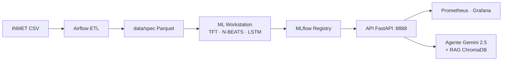

# WeatherOps

Plataforma de engenharia de dados e machine learning para previsão meteorológica de séries temporais. Pipeline completo: ingestão de dados INMET → ETL com Airflow → treinamento de modelos (TFT, N-BEATS, LSTM, Transformer) → serving via API REST → monitoramento com Prometheus/Grafana e agente conversacional com Gemini 2.5 Flash.

---

## Arquitetura



---

## Início Rápido

| Objetivo | Guia |
|---|---|
| Usar a API com modelos já prontos | [docs/guides/QUICKSTART.md](docs/guides/QUICKSTART.md) |
| Usar o agente conversacional | [docs/guides/AGENT_QUICKSTART.md](docs/guides/AGENT_QUICKSTART.md) |
| Rodar o pipeline do zero (dados → treino → API) | [docs/guides/END_TO_END_GUIDE.md](docs/guides/END_TO_END_GUIDE.md) |

---

## Serviços Locais

| Serviço | URL | Credenciais | Compose |
|---|---|---|---|
| API + Swagger | http://localhost:8888 · /docs | — | `src/api/docker-compose.yml` |
| MLflow UI | http://localhost:5001 | — | `src/api/docker-compose.yml` |
| Prometheus | http://localhost:9090 | — | `src/api/docker-compose.yml` |
| Grafana | http://localhost:3000 | admin / admin | `src/api/docker-compose.yml` |
| Airflow | http://localhost:8080 | airflow / airflow | `docker-compose-airflow.yaml` |

> Todos os serviços da API (incluindo Prometheus e Grafana) sobem com um único comando:
> `docker compose -f src/api/docker-compose.yml --profile api up -d`

---

## Estrutura do Repositório

| Caminho | Responsabilidade |
|---|---|
| `core/` | Limpeza de dados e geração de features |
| `src/data_airflow/` | Orquestração ETL com Apache Airflow |
| `src/ml_workstation/` | Treinamento, tracking (MLflow) e promoção de modelos |
| `src/api/` | API FastAPI de serving com monitoramento |
| `src/api_agent/` | Agente conversacional (Gemini + RAG) |
| `data/raw/` | CSVs brutos do INMET (por ano) |
| `data/spec/` | Parquet com features por município |
| `scripts/` | Smoke tests e scripts de automação |

---

## Pré-requisitos

| Ferramenta | Versão | Para quê |
|---|---|---|
| Docker + Docker Compose V2 | 24+ | Subir todos os serviços |
| Python + Poetry | 3.12+ / 1.8+ | Desenvolvimento local e treino |
| `GOOGLE_API_KEY` | — | Apenas para o agente conversacional |

---

## Testes

```bash
poetry install --with dev
poetry run pytest --cov=core --cov=src --cov-report=term-missing
```

Cobertura mínima exigida no CI: **60%**.

---

## Documentação Técnica

| Componente | Referência |
|---|---|
| Engenharia de dados | [core/data_engineering/README.md](core/data_engineering/README.md) · [core/ARCHITECTURE.md](core/ARCHITECTURE.md) |
| Airflow | [src/data_airflow/README.md](src/data_airflow/README.md) |
| ML Workstation | [src/ml_workstation/README.md](src/ml_workstation/README.md) · [PROMOTION.md](src/ml_workstation/promotion/PROMOTION.md) |
| API | [src/api/README.md](src/api/README.md) · [src/api/ARCHITECTURE.md](src/api/ARCHITECTURE.md) |
| Agente | [src/api_agent/README.md](src/api_agent/README.md) |
| Segurança / LGPD | [docs/security/](docs/security/) |
