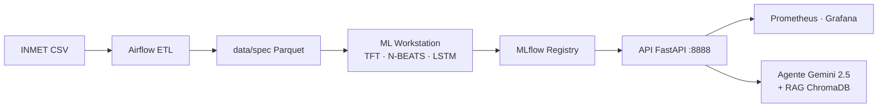
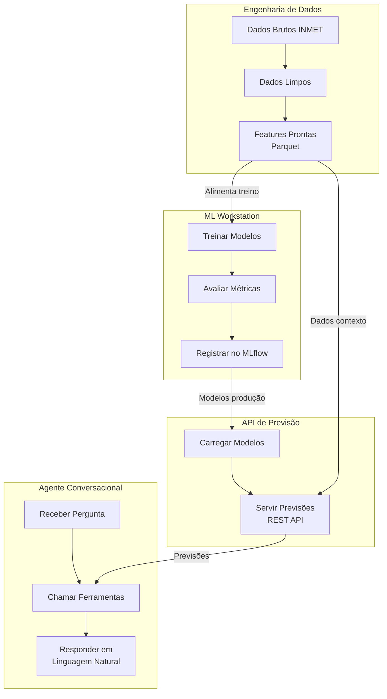
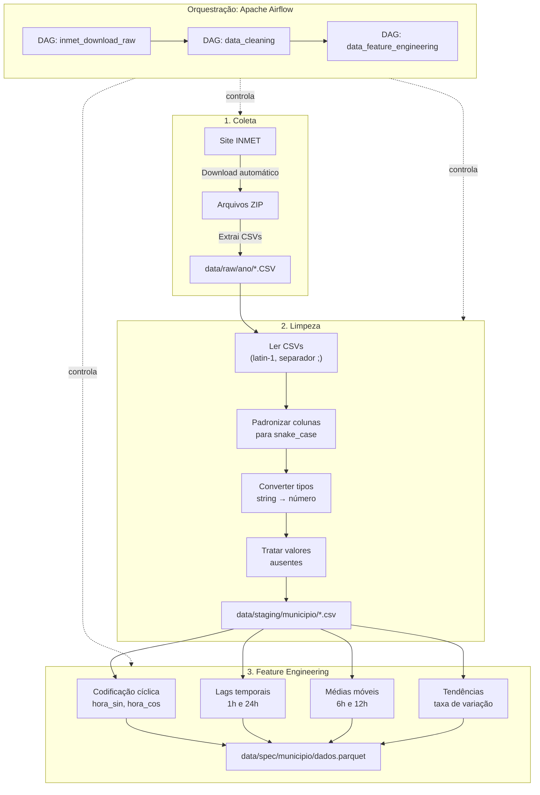
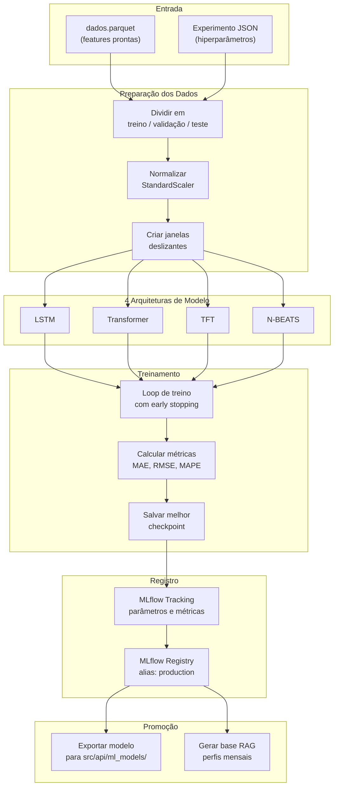
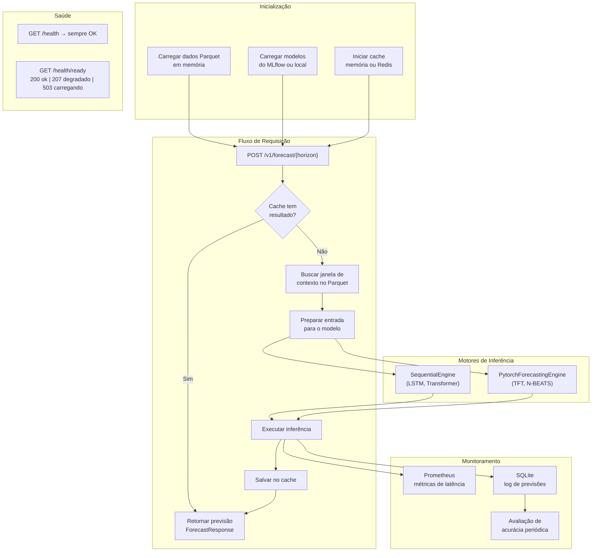
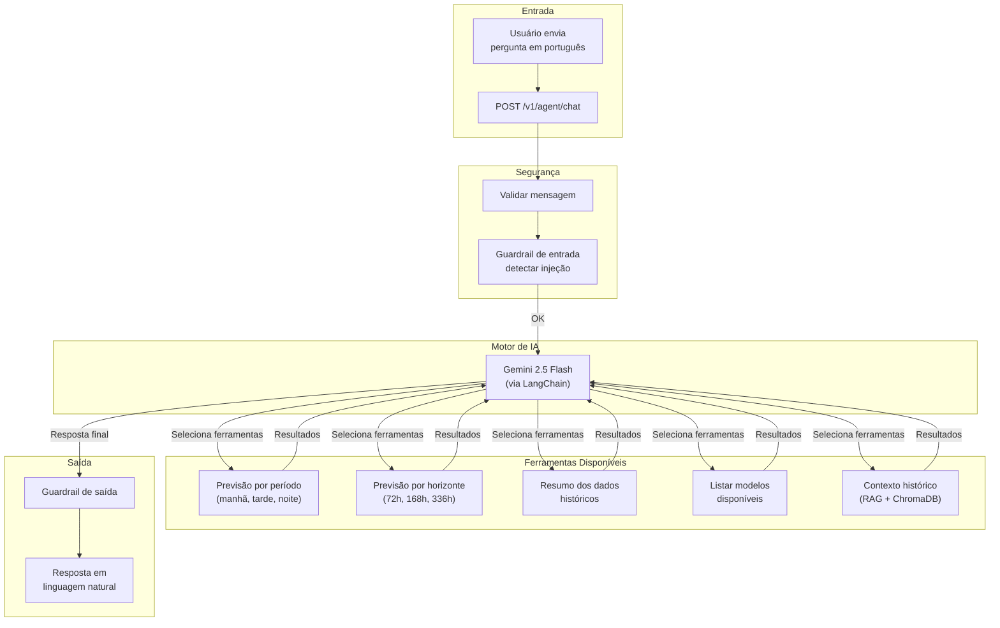

# WeatherOps

Plataforma de engenharia de dados e machine learning para previsão meteorológica de séries temporais. Pipeline completo: ingestão de dados INMET → ETL com Airflow → treinamento de modelos (TFT, N-BEATS, LSTM, Transformer) → serving via API REST → monitoramento com Prometheus/Grafana e agente conversacional com Gemini 2.5 Flash.

---

## Arquitetura



---

## Início Rápido

| Objetivo | Guia |
|---|---|
| Usar a API com modelos já prontos | [docs/guides/QUICKSTART.md](docs/guides/QUICKSTART.md) |
| Usar o agente conversacional | [docs/guides/AGENT_QUICKSTART.md](docs/guides/AGENT_QUICKSTART.md) |
| Rodar o pipeline do zero (dados → treino → API) | [docs/guides/END_TO_END_GUIDE.md](docs/guides/END_TO_END_GUIDE.md) |

‼️**OBS : O pipeline está pronto somente para o uso do modelo TFT. **‼️

---

## Serviços Locais

| Serviço | URL | Credenciais | Compose |
|---|---|---|---|
| API + Swagger | http://localhost:8888 · /docs | — | `src/api/docker-compose.yml` |
| MLflow UI | http://localhost:5001 | — | `src/api/docker-compose.yml` |
| Prometheus | http://localhost:9090 | — | `src/api/docker-compose.yml` |
| Grafana | http://localhost:3000 | admin / admin | `src/api/docker-compose.yml` |
| Airflow | http://localhost:8080 | airflow / airflow | `docker-compose-airflow.yaml` |

> Todos os serviços da API (incluindo Prometheus e Grafana) sobem com um único comando:
> `docker compose -f src/api/docker-compose.yml --profile api up -d`

---

## Estrutura do Repositório

| Caminho | Responsabilidade |
|---|---|
| `core/` | Limpeza de dados e geração de features |
| `src/data_airflow/` | Orquestração ETL com Apache Airflow |
| `src/ml_workstation/` | Treinamento, tracking (MLflow) e promoção de modelos |
| `src/api/` | API FastAPI de serving com monitoramento |
| `src/api_agent/` | Agente conversacional (Gemini + RAG) |
| `data/raw/` | CSVs brutos do INMET (por ano) |
| `data/spec/` | Parquet com features por município |
| `scripts/` | Smoke tests e scripts de automação |

---

## Pré-requisitos

| Ferramenta | Versão | Para quê |
|---|---|---|
| Docker + Docker Compose V2 | 24+ | Subir todos os serviços |
| Python + Poetry | 3.12+ / 1.8+ | Desenvolvimento local e treino |
| `GOOGLE_API_KEY` | — | Apenas para o agente conversacional |

---

## Testes

```bash
poetry install --with dev
poetry run pytest --cov=core --cov=src --cov-report=term-missing
```

Cobertura mínima exigida no CI: **60%**.

---

## Documentação Técnica

| Componente | Referência |
|---|---|
| Engenharia de dados | [core/data_engineering/README.md](core/data_engineering/README.md) · [core/ARCHITECTURE.md](core/ARCHITECTURE.md) |
| Airflow | [src/data_airflow/README.md](src/data_airflow/README.md) |
| ML Workstation | [src/ml_workstation/README.md](src/ml_workstation/README.md) · [PROMOTION.md](src/ml_workstation/promotion/PROMOTION.md) |
| API | [src/api/README.md](src/api/README.md) · [src/api/ARCHITECTURE.md](src/api/ARCHITECTURE.md) |
| Agente | [src/api_agent/README.md](src/api_agent/README.md) |
| Segurança / LGPD | [docs/security/](docs/security/) |


---
---
---

# Arquitetura do WeatherOps

O **WeatherOps** é uma plataforma de previsão meteorológica que vai desde a coleta de dados brutos até a entrega de previsões por API e por um agente conversacional inteligente.

O projeto é dividido em **4 setores principais**:

| Setor | O que faz |
|-------|-----------|
| **Engenharia de Dados** | Coleta, limpa e transforma dados meteorológicos do INMET |
| **ML Workstation** | Treina e avalia modelos de deep learning para previsão de temperatura |
| **API de Previsão** | Serve previsões via endpoints REST com cache e monitoramento |
| **Agente Conversacional** | Responde perguntas em linguagem natural usando IA e ferramentas |

## Estrutura de diretórios resumida

```
WeatherOps/
├── core/                              # Lógica de engenharia de dados
│   └── data_engineering/
│       ├── data_cleaning/             # Limpeza de dados INMET
│       ├── data_feature_eng/          # Geração de features
│       ├── interface/                 # Contratos abstratos
│       └── models/                    # Schemas Pydantic
│
├── src/
│   ├── data_airflow/                  # Orquestração Airflow
│   │   ├── dags/                      # 3 DAGs do pipeline
│   │   ├── config/                    # Configs YAML
│   │   └── scraping/                  # Download INMET
│   │
│   ├── ml_workstation/                # Treinamento ML
│   │   ├── config/                    # TrainingConfig
│   │   ├── data/                      # Data loaders
│   │   ├── models/                    # LSTM, Transformer, TFT, N-BEATS
│   │   ├── training/                  # Loops de treino
│   │   ├── tracking/                  # MLflow
│   │   ├── evaluation/                # Relatórios
│   │   ├── promotion/                 # Exportação para produção
│   │   └── experiments/               # JSONs de experimentos
│   │
│   ├── api/                           # API FastAPI
│   │   ├── routers/                   # Endpoints
│   │   ├── services/                  # DataService, ModelRegistry, Predictor
│   │   ├── engines/                   # Motores de inferência
│   │   ├── schemas/                   # Request/Response
│   │   └── ml_models/                 # Modelos exportados
│   │
│   └── api_agent/                     # Agente conversacional
│       ├── routers/                   # Endpoint /chat
│       ├── tools/                     # 5 ferramentas do agente
│       ├── rag/                       # Retriever + knowledge builder
│       └── knowledge/                 # ChromaDB
│
├── data/
│   ├── raw/                           # CSVs brutos INMET
│   ├── staging/                       # CSVs limpos
│   └── spec/                          # Parquets com features
│
└── docs/                              # Documentação
```

---

## Visão Geral — Como os setores se conectam



**Como funciona o fluxo:**

1. A **Engenharia de Dados** coleta dados do INMET, limpa e gera features — o resultado são arquivos Parquet prontos para uso
2. O **ML Workstation** usa esses Parquets para treinar modelos (LSTM, Transformer, TFT, N-BEATS) e registra os melhores no MLflow
3. A **API** carrega os modelos registrados e os dados Parquet, servindo previsões via REST
4. O **Agente** recebe perguntas em português e usa a API internamente para responder com previsões

---

## Setor 1 — Engenharia de Dados

Pipeline automatizado que transforma dados brutos do INMET em features prontas para treinar modelos de machine learning.



### Arquivos de código — Engenharia de Dados

#### Lógica principal (core/)

| Arquivo | O que faz |
|---------|-----------|
| `core/data_engineering/data_cleaning/data_cleaning.py` | Classe `DataCleaning` — lê CSVs do INMET, padroniza colunas, converte tipos, trata valores nulos |
| `core/data_engineering/data_feature_eng/feature_eng.py` | Classe `WeatherFeatureEngineer` — gera features derivadas (lags, médias móveis, codificação cíclica, tendências) |
| `core/data_engineering/interface/i_data_eng.py` | Interface base `IDataEngineering` — contrato abstrato que as etapas do pipeline implementam |
| `core/data_engineering/models/data_cleaning/inputs.py` | Modelos Pydantic — `DataEngInput`, `CsvReadConfig`, `ColumnRenameConfig` (schemas de entrada da limpeza) |
| `core/data_engineering/models/feature_engineering/inputs.py` | Modelos Pydantic — `FeatureEngineeringConfig`, `WeatherFeatureEngineerInput` (schemas da feature engineering) |

#### Orquestração Airflow (src/data_airflow/)

| Arquivo | O que faz |
|---------|-----------|
| `src/data_airflow/dags/inmet_download_raw.py` | DAG que baixa dados do site INMET — cria uma task por ano, extrai ZIPs para `data/raw/` |
| `src/data_airflow/dags/data_cleaning.py` | DAG que descobre CSVs por município, aplica `DataCleaning` e salva em `data/staging/` |
| `src/data_airflow/dags/data_feature_engineering.py` | DAG que lê CSVs limpos, aplica `WeatherFeatureEngineer` e salva Parquets em `data/spec/` |
| `src/data_airflow/scraping/inmet.py` | Funções de scraping — download de ZIPs do INMET com retry e backoff exponencial |
| `src/data_airflow/config/inmet_scraping.yml` | Configuração do range de anos para download (ex: 2024 a 2026) |
| `src/data_airflow/config/municipios.yml` | Filtro de municípios — quais incluir/excluir do processamento |
| `docker-compose-airflow.yaml` | Infraestrutura Airflow — PostgreSQL, Redis, webserver, scheduler, worker |
| `src/data_airflow/Dockerfile` | Imagem Docker do Airflow com dependências do projeto |

#### Diretórios de dados

| Diretório | Conteúdo |
|-----------|----------|
| `data/raw/<ano>/` | CSVs brutos baixados do INMET (encoding latin-1, separador `;`) |
| `data/staging/<municipio>/` | CSVs limpos e padronizados por município |
| `data/spec/<municipio>/` | Parquets com todas as features prontas para ML |

---

## Setor 2 — ML Workstation

Ambiente de treinamento que suporta 4 arquiteturas de deep learning, com rastreamento de experimentos via MLflow.



### Arquivos de código — ML Workstation

#### Entrada e configuração

| Arquivo | O que faz |
|---------|-----------|
| `src/ml_workstation/train.py` | Ponto de entrada principal — recebe um JSON de experimento, roteia para o pipeline correto (LSTM/Transformer ou TFT/N-BEATS) |
| `src/ml_workstation/config/training_config.py` | Classes `TrainingConfig`, `DataConfig`, `ModelConfig` — define todos os hiperparâmetros e governança |
| `src/ml_workstation/experiments/lstm/` | JSONs de experimentos LSTM (ex: `lstm_h72_v1.json`) com hiperparâmetros por horizonte |
| `src/ml_workstation/experiments/transformer/` | JSONs de experimentos Transformer |
| `src/ml_workstation/experiments/tft/` | JSONs de experimentos TFT (Temporal Fusion Transformer) |
| `src/ml_workstation/experiments/nbeats/` | JSONs de experimentos N-BEATS |

#### Carregamento de dados

| Arquivo | O que faz |
|---------|-----------|
| `src/ml_workstation/data/loader.py` | `ParquetDataLoader` — lê Parquet, aplica StandardScaler, cria `WeatherSequenceDataset` com janelas deslizantes (para LSTM/Transformer) |
| `src/ml_workstation/data/pf_loader.py` | `PytorchForecastingDataLoader` — constrói `TimeSeriesDataSet` do pytorch-forecasting com classificação automática de features (para TFT/N-BEATS) |

#### Definição dos modelos

| Arquivo | O que faz |
|---------|-----------|
| `src/ml_workstation/models/lstm.py` | `WeatherLSTM` — camadas LSTM empilhadas + cabeçalho linear |
| `src/ml_workstation/models/transformer.py` | `WeatherTransformer` — codificação posicional + TransformerEncoder + pooling + linear |
| `src/ml_workstation/models/tft.py` | `WeatherTFT` — Temporal Fusion Transformer (Lim et al., 2021) via pytorch-forecasting |
| `src/ml_workstation/models/nbeats.py` | `WeatherNBEATS` — N-BEATS (Oreshkin et al., 2020) via pytorch-forecasting |

#### Treinamento

| Arquivo | O que faz |
|---------|-----------|
| `src/ml_workstation/training/trainer.py` | `Trainer` — loop manual de treino/validação com early stopping, salva `best_model.pt` (para LSTM/Transformer) |
| `src/ml_workstation/training/pf_trainer.py` | `PytorchForecastingTrainer` — usa PyTorch Lightning com callbacks de early stopping e checkpoint (para TFT/N-BEATS) |

#### Rastreamento e promoção

| Arquivo | O que faz |
|---------|-----------|
| `src/ml_workstation/tracking/mlflow_tracker.py` | `MLflowTracker` — registra parâmetros, métricas, artefatos e modelo no MLflow |
| `src/ml_workstation/evaluation/run_evaluation.py` | Gera relatórios HTML comparando previsões vs valores reais no conjunto de teste |
| `src/ml_workstation/promotion/run_promote.py` | Promove o melhor modelo — exporta para `src/api/ml_models/`, registra no MLflow Registry com alias `production`, gera base de conhecimento RAG |

#### Horizontes suportados

| Horizonte | Significado |
|-----------|-------------|
| h72 | Previsão para 3 dias (72 horas) |
| h168 | Previsão para 7 dias (168 horas) |
| h336 | Previsão para 14 dias (336 horas) |

---

## Setor 3 — API de Previsão

Serviço FastAPI que carrega modelos treinados e serve previsões de temperatura via REST, com cache, health checks e métricas Prometheus.



### Arquivos de código — API de Previsão

#### Aplicação principal

| Arquivo | O que faz |
|---------|-----------|
| `src/api/main.py` | Cria a aplicação FastAPI — gerencia startup (carrega dados e modelos) e shutdown |
| `src/api/config.py` | `Settings` (variáveis de ambiente) e `REGISTERED_MODELS` — lista declarativa de todos os modelos servidos, com features, horizonte e tipo de engine |

#### Endpoints (routers/)

| Arquivo | O que faz |
|---------|-----------|
| `src/api/routers/forecast.py` | `POST /v1/forecast/{horizon}` — recebe requisição de previsão, verifica cache, chama predictor |
| `src/api/routers/health.py` | `GET /health` (liveness) e `GET /health/ready` (readiness com status 200/207/503) |

#### Serviços (services/)

| Arquivo | O que faz |
|---------|-----------|
| `src/api/services/data_service.py` | `DataService` — carrega Parquet em memória, fornece janelas de contexto por data de referência |
| `src/api/services/model_registry.py` | `ModelRegistry` — carrega todos os modelos em paralelo (do MLflow ou exportação local), armazena `ModelEntry` com modelo + engine + metadata |
| `src/api/services/predictor.py` | `Predictor` — orquestra a inferência completa: resolve modelo → busca contexto → prepara input → executa engine → pós-processa |
| `src/api/services/prediction_logger.py` | `PredictionLogger` — registra previsões em SQLite para avaliação posterior |
| `src/api/services/accuracy_evaluator.py` | `AccuracyEvaluator` — tarefa em background que compara previsões com dados reais (MAE, RMSE, MAPE) |

#### Motores de inferência (engines/)

| Arquivo | O que faz |
|---------|-----------|
| `src/api/engines/base.py` | `BaseInferenceEngine` — interface abstrata com métodos `prepare_metadata`, `prepare_input`, `run_inference`, `postprocess` |
| `src/api/engines/sequential.py` | `SequentialEngine` — inferência para LSTM e Transformer (usa scaler + forward pass direto) |
| `src/api/engines/pytorch_forecasting.py` | `PytorchForecastingEngine` — inferência para TFT e N-BEATS (reconstrói TimeSeriesDataSet, usa `model.predict()`) |

#### Schemas e utilitários

| Arquivo | O que faz |
|---------|-----------|
| `src/api/schemas/` | Modelos Pydantic — `ForecastRequest` (entrada), `ForecastResponse` (saída com previsões, latência, versão do modelo) |
| `src/api/cache.py` | Backends de cache — `InMemoryResponseCache` (por processo) ou `RedisResponseCache` (distribuído), com TTL configurável |
| `src/api/metrics.py` | Métricas Prometheus — contadores de requisições, histogramas de latência, taxa de cache hit/miss |

#### Infraestrutura

| Arquivo | O que faz |
|---------|-----------|
| `src/api/docker-compose.yml` | Infraestrutura da API — serviço FastAPI, MLflow, Prometheus, Grafana |
| `src/api/ml_models/` | Diretório com modelos exportados localmente (alternativa ao MLflow Registry) |

#### Endpoints disponíveis

| Endpoint | Método | Descrição |
|----------|--------|-----------|
| `/health` | GET | Verifica se a API está viva (sempre 200) |
| `/health/ready` | GET | Verifica se modelos estão carregados (200 ok, 207 degradado, 503 carregando) |
| `/v1/forecast/{horizon}` | POST | Previsão de temperatura (horizonte: 72, 168 ou 336 horas) |
| `/metrics` | GET | Métricas Prometheus para monitoramento |
| `/docs` | GET | Documentação interativa Swagger UI |

---

## Setor 4 — Agente Conversacional

Interface conversacional que entende perguntas em português e usa ferramentas para buscar previsões, dados históricos e informações sobre os modelos.



### Arquivos de código — Agente Conversacional

#### Endpoint e orquestração

| Arquivo | O que faz |
|---------|-----------|
| `src/api_agent/routers/agent.py` | `POST /v1/agent/chat` — recebe mensagem, aplica guardrails, chama o agente, retorna resposta |
| `src/api_agent/service.py` | `run_agent_chat` — orquestra o loop do agente: envia mensagem ao Gemini, executa tool calls, repete até ter resposta final (máx 5 iterações) |
| `src/api_agent/schemas.py` | `AgentChatRequest` (mensagem do usuário) e `AgentChatResponse` (resposta + tool calls + snippets RAG) |
| `src/api_agent/guardrails.py` | `check_input` e `check_output` — detectam injeção de prompt, SQL injection e conteúdo malicioso |

#### Ferramentas (tools/)

| Arquivo | O que faz |
|---------|-----------|
| `src/api_agent/tools/period_forecast_tool.py` | `get_forecast_by_period` — previsão por período do dia (manhã 7-12h, tarde 12-17h, noite 17-24h, madrugada 0-7h) |
| `src/api_agent/tools/forecast_tool.py` | `run_weather_forecast` — previsão por horizonte específico (72h, 168h, 336h), chama o `Predictor` diretamente |
| `src/api_agent/tools/dataset_tool.py` | `summarize_dataset_window` — resume dados históricos (min, max, média) de uma janela de tempo |
| `src/api_agent/tools/models_tool.py` | `list_available_models` — lista modelos e horizontes disponíveis a partir de `REGISTERED_MODELS` |
| `src/api_agent/tools/historical_context.py` | `get_historical_weather_context` — busca padrões climáticos sazonais via RAG (ChromaDB) |

#### RAG — Base de conhecimento (rag/)

| Arquivo | O que faz |
|---------|-----------|
| `src/api_agent/rag/retriever.py` | `FeatureStoreRetriever` — busca vetorial no ChromaDB usando embeddings Google (gemini-embedding-001) |
| `src/api_agent/rag/knowledge_builder.py` | Constrói a base ChromaDB a partir dos perfis mensais e extremos sazonais gerados na promoção do modelo |
| `src/api_agent/knowledge/chroma_db/` | Diretório da base vetorial ChromaDB (gerado automaticamente) |

#### Base de conhecimento RAG (gerada na promoção)

| Arquivo | Conteúdo |
|---------|----------|
| `src/api/ml_models/weather_forecasting_h72/feature_store/metadata.json` | Município, range de datas dos dados |
| `src/api/ml_models/weather_forecasting_h72/feature_store/monthly_profiles.json` | Médias mensais por feature (perfis climáticos) |
| `src/api/ml_models/weather_forecasting_h72/feature_store/seasonal_extremes.json` | Percentis 5% e 95% por mês (extremos sazonais) |

---