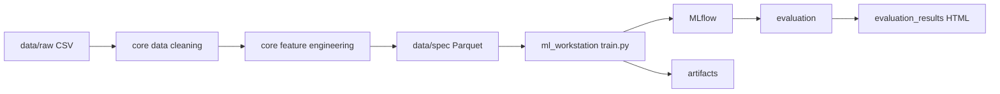

# WeatherOps

Plataforma de engenharia de dados e machine learning para previsao meteorologica com foco em series temporais, reproducibilidade e rastreabilidade.

## Visao Geral

O projeto conecta quatro blocos principais:

1. Engenharia de dados em `core`.
2. Orquestracao de pipelines em `src/data_airflow`.
3. Treinamento e tracking em `src/ml_workstation`.
4. Avaliacao visual de runs em `src/ml_workstation/evaluation`.

## Fluxo Ponta a Ponta



Mais detalhes: `docs/PIPELINE_FLOW.md`.

## Mapa de Documentacao

- Geral: `docs/DEVELOPMENT_SETUP.md`, `docs/TROUBLESHOOTING.md`, `docs/PIPELINE_FLOW.md`
- Core: `core/README.md`, `core/ARCHITECTURE.md`
- Airflow: `src/data_airflow/README.md`, `src/data_airflow/ARCHITECTURE.md`
- ML Workstation: `src/ml_workstation/README.md`, `src/ml_workstation/ARCHITECTURE.md`
- Avaliacao: `src/ml_workstation/evaluation/README.md`

## Estrutura do Repositorio

```text
WeatherOps/
├── core/
├── data/
├── docs/
├── notebooks/
├── src/
│   ├── data_airflow/
│   └── ml_workstation/
├── test/
├── pyproject.toml
├── docker-compose-airflow.yaml
└── data.dvc
```

## Stack Tecnologica

- Python 3.12+
- Poetry
- Pandas, Scikit-learn
- PyTorch
- MLflow
- Plotly
- DVC
- Docker Compose
- Apache Airflow

## Setup Rapido

Instalacao local:

```bash
poetry install
poetry run pytest
poetry run pytest --cov=core --cov=src --cov-report=term-missing
```

Treino local via Poetry:

```bash
poetry run python -m src.ml_workstation.train --config src/ml_workstation/experiments/lstm/lstm_h72_v1.json
```

Treino via Docker (CPU):

```bash
cd src/ml_workstation
docker compose --profile train build trainer
docker compose --profile train run --rm trainer --config //app/experiments/lstm/lstm_h72_v1.json
```

Treino via Docker (GPU):

```bash
docker compose --profile train-gpu run --rm trainer-gpu --config //app/experiments/lstm/lstm_h72_v1.json
```

Observacao (Windows + Git Bash): use `//app/...` para caminhos no container.

## MLflow

Subir UI local:

```bash
cd src/ml_workstation
docker compose --profile ui up -d mlflow-ui
```

Acesso: http://localhost:5000

## Airflow

Subir stack local:

```bash
docker compose -f docker-compose-airflow.yaml up airflow-init
docker compose -f docker-compose-airflow.yaml up -d
```

Acesso: http://localhost:8080

## Avaliacao de Runs

```bash
poetry run python -m src.ml_workstation.evaluation.run_evaluation --run-id <RUN_ID>
```

Saida: HTML em `evaluation_results/`.

## Qualidade e Governanca

- Configs de experimento versionadas em `src/ml_workstation/experiments`.
- Metadados de governanca registrados no MLflow (tags e params).
- Testes unitarios e de integracao organizados em `test/`.

## Licenca

Este projeto esta licenciado conforme `LICENSE`.
