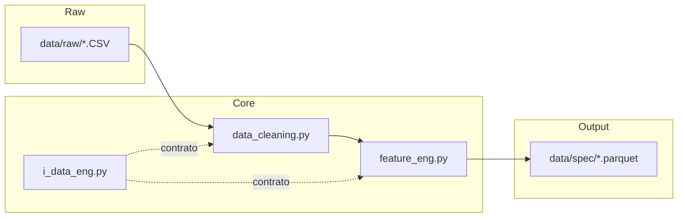

# Core Architecture

Arquitetura tecnica do modulo `core`.

## Principios

- Pipeline em etapas claras e testaveis.
- Contratos explicitos entre limpeza e feature engineering.
- Saida padronizada para consumo pelo treinamento.

## Diagrama de Componentes

## Contratos de Entrada e Saida

Entrada esperada:
- Dados meteorologicos tabulares por estacao e timestamp.

Saida esperada:
- Parquets com colunas numericas prontas para treino.
- Colunas temporais derivadas e features de contexto.

## Dependencias

- Pandas para manipulacao tabular.
- Scikit-learn para operacoes de preparacao quando necessario.

## Pontos de Acoplamento

- `src/ml_workstation/data/loader.py` depende da consistencia do schema produzido em `data/spec`.
- Mudancas em nomes de colunas devem ser refletidas nos arquivos de experimento.

## Evolucao Recomendada

1. Definir schema formal versionado para `data/spec`.
2. Acrescentar validacao automatica de contrato no CI.
3. Expandir testes para casos de borda de sazonalidade e faltantes extremos.
