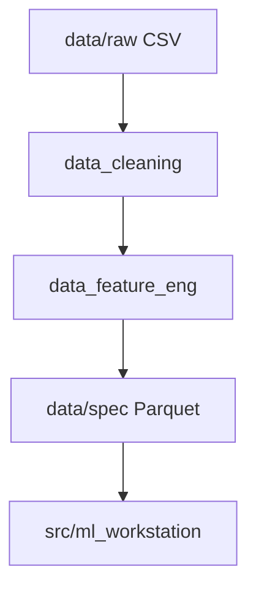

# Core

Modulo de engenharia de dados do WeatherOps.

## Objetivo

Transformar dados meteorologicos brutos em dados confiaveis e model-ready para consumo no treinamento.

## Estrutura

```text
core/
├── data_engineering/
│   ├── data_cleaning/
│   │   └── data_cleaning.py
│   ├── data_feature_eng/
│   │   └── feature_eng.py
│   ├── interface/
│   │   └── i_data_eng.py
│   └── models/
├── data_analynitcs/
│   ├── graphs_maker/
│   ├── inputs/
│   └── interface/
└── __init__.py
```

Nota: o nome `data_analynitcs` esta mantido por compatibilidade atual do repositorio.

## Fluxo de Engenharia de Dados



## Componentes Principais

- `data_cleaning`: padronizacao de schema, tratamento de nulos e consistencia de valores.
- `data_feature_eng`: criacao de variaveis de tempo, lags e agregacoes.
- `interface/i_data_eng.py`: contrato para pipelines de engenharia de dados.

## Boas Praticas

1. Preservar determinismo no pipeline para reproducibilidade.
2. Versionar alteracoes de schema com impacto em treino.
3. Validar colunas finais antes de publicar em `data/spec`.
4. Cobrir transformacoes criticas com testes unitarios.

## Testes

Testes de core estao organizados em:

- `test/unit/core/data_engineering/data_cleaning`
- `test/unit/core/data_engineering/data_feature_eng`
