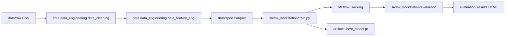

# Fluxo de Pipeline WeatherOps

Este documento descreve o fluxo ponta a ponta entre engenharia de dados, orquestracao e treinamento.

## Visao Geral

## Etapas

1. Ingestao: os CSVs de estacoes meteorologicas sao colocados em `data/raw`.
2. Limpeza: o modulo de cleaning padroniza schema, remove inconsistencias e trata faltantes.
3. Feature engineering: o modulo de features cria lags, medias moveis e variaveis ciclicas.
4. Publicacao: o conjunto final vai para `data/spec` em formato Parquet.
5. Treinamento: configs JSON em `src/ml_workstation/experiments` definem o run.
6. Tracking: metricas, parametros, tags e artefatos sao registrados no MLflow.
7. Avaliacao: a partir de um `run_id`, o modulo de avaliacao gera graficos HTML real vs predito.

## Contratos Entre Camadas

- Entrada padrao de treino: Parquets em `data/spec`.
- Configuracao de treino: JSON validado por Pydantic (`TrainingConfig`).
- Saida de treino: `mlruns/` e `artifacts/`.
- Saida de avaliacao: `evaluation_results/*.html`.

## Riscos Operacionais

- Alteracao de nomes de colunas em `data/spec` sem atualizar `feature_columns` quebra treino.
- Mudanca de formato de checkpoint sem fallback pode quebrar avaliacao.
- Execucoes longas sem smoke test aumentam custo de retrabalho.

## Checklist Rapido Antes de Treinar

1. `data/spec` atualizado e consistente.
2. Config JSON valida e com `device` correto para o ambiente.
3. Smoke test executado com sucesso.
4. MLflow UI disponivel para observabilidade.
