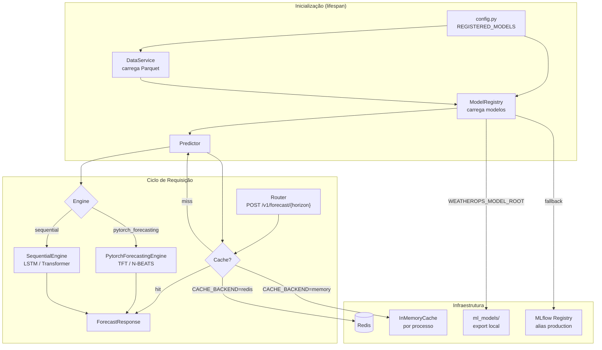

# API de Serving — Arquitetura

Este documento descreve o design técnico da API de serving do WeatherOps. Para instruções operacionais (como subir, variáveis de ambiente, exemplos de requisição), consulte o [README.md](README.md).

---

## Visão Geral

A API é uma aplicação FastAPI assíncrona que serve previsões horárias de temperatura para horizontes de 72, 168 e 336 horas. Os modelos são carregados do MLflow Model Registry (ou de um diretório local exportado) durante a inicialização e mantidos em memória. Cada requisição de forecast passa por um cache antes de chegar ao pipeline de inferência.

---

## Princípios de Design

| Princípio | Implementação |
|-----------|--------------|
| **Strategy pattern** | `BaseInferenceEngine` com implementações `PytorchForecastingEngine` e `SequentialEngine` — trocar arquitetura não exige mudança no `Predictor` |
| **Fonte única de configuração** | `REGISTERED_MODELS` em `config.py` é o único lugar onde novos modelos são declarados |
| **I/O não-bloqueante** | Operações de CPU pesadas (carregamento de modelo, inferência) são delegadas a `asyncio.to_thread` |
| **Cache polimórfico** | `InMemoryResponseCache` e `RedisResponseCache` implementam o mesmo protocolo; troca via variável de ambiente |
| **Observabilidade garantida** | `X-Trace-Id` em todos os responses independe de OpenTelemetry estar configurado |
| **Degradação graciosa** | Falha ao carregar um modelo não impede os demais; `/health/ready` retorna 207 (degradado) em vez de 503 |

---

## Diagrama de Componentes



---

## Camadas

### 1. Inicialização — `main.py`

O ciclo de vida da aplicação (`@asynccontextmanager lifespan`) executa na seguinte sequência durante o startup:

1. Carrega `Settings` (leitura de variáveis de ambiente)
2. Instancia `DataService` e chama `await data_service.load(parquet_path, columns)` — lê o Parquet para memória
3. Instancia `ModelRegistry` e chama `await registry.load_all(configs, data_service, ...)` — carrega todos os modelos em paralelo
4. Instancia `Predictor(registry, data_service)`
5. Armazena tudo em `app.state` para injeção de dependência

Erros de carregamento de modelos individuais são capturados e logados, mas não interrompem o startup.

---

### 2. Configuração — `config.py`

**`REGISTERED_MODELS`** é uma lista de `ServingModelConfig`. Adicionar um novo modelo = adicionar uma entrada nessa lista. Os horizontes válidos (`VALID_HORIZONS`) são derivados automaticamente dessa lista.

```python
@dataclass
class ServingModelConfig:
    key: str                  # ex.: "tft_72"
    experiment_name: str      # nome do experimento no MLflow
    model_type: str           # "tft" | "nbeats" | "lstm" | "transformer"
    horizon: int              # horizonte em horas (72, 168, 336)
    sequence_length: int      # janela de contexto (lookback) em horas
    engine_class: str         # "pytorch_forecasting" | "sequential"
    registry_model_name: str  # nome no MLflow Model Registry (padrão: experiment_name)
    feature_columns: list[str]
    target_columns: list[str]
```

**`Settings`** (Pydantic `BaseSettings`) lê variáveis de ambiente. As mais importantes:

| Variável | Padrão | Descrição |
|----------|--------|-----------|
| `MLFLOW_TRACKING_URI` | — | URI do servidor MLflow ou caminho `file://` |
| `WEATHEROPS_MODEL_ROOT` | — | Diretório com modelos exportados (substitui o Registry) |
| `PARQUET_PATH` | `/app/data/spec` | Caminho para o dataset Parquet |
| `DEVICE` | `cpu` | Dispositivo de inferência (`cpu` ou `cuda`) |
| `CACHE_BACKEND` | `memory` | Backend de cache (`memory` ou `redis`) |
| `CACHE_TTL_SECONDS` | `3600` | TTL do cache em segundos |

---

### 3. Roteadores — `routers/`

Dois roteadores registrados no app:

**`health.py`** — sem prefixo:
- `GET /health` — liveness probe; sempre retorna `{"status": "ok"}` enquanto o processo estiver vivo
- `GET /health/ready` — readiness probe; retorna 200 (pronto), 207 (degradado) ou 503 (carregando)

**`forecast.py`** — prefixo `/v1/forecast`:
- `POST /{horizon}` — recebe `ForecastRequest`, retorna `ForecastResponse`

---

### 4. Serviços — `services/`

**`DataService`** (`data_service.py`):
- Lê o Parquet uma vez no startup e mantém o DataFrame em memória
- Pré-computa `time_idx` (inteiro sequencial) e `group` (constante `"station_1"`) que o `TimeSeriesDataSet` exige
- `get_context_window(reference_date, sequence_length)` retorna as últimas `sequence_length` linhas ≤ `reference_date`
- `get_training_slice(train_ratio)` retorna a fatia de treino para reconstruir o `TimeSeriesDataSet` durante o startup
- Thread-safe para leitura concorrente (escrita única no startup)

**`ModelRegistry`** (`model_registry.py`):
- Carrega todos os modelos em paralelo no startup via `asyncio.gather`
- Cada modelo é representado por `ModelEntry`:
  ```python
  @dataclass
  class ModelEntry:
      model: torch.nn.Module
      engine: BaseInferenceEngine
      config: ServingModelConfig
      metadata: dict          # training_dataset (TFT) ou scaler (LSTM)
      version: str            # versão no MLflow Registry
      mape: float | None      # MAPE registrado na promoção
  ```
- `get(key)` levanta `KeyError` com mensagem que lista modelos disponíveis e com falha

**`Predictor`** (`predictor.py`):
- Orquestra o ciclo completo de inferência para cada requisição
- Delega operações síncronas bloqueantes ao thread pool via `asyncio.to_thread`
- Mede latência end-to-end (entre a chegada da requisição e a construção da resposta)

---

### 5. Engines de Inferência — `engines/`

Todos os engines implementam `BaseInferenceEngine`:

```python
class BaseInferenceEngine(ABC):
    async def prepare_metadata(self, cfg, data_service) -> dict: ...
    # chamado uma vez no startup; retorna dict armazenado em ModelEntry.metadata

    def prepare_input(self, window_df, ctx: InferenceContext) -> Any: ...
    # converte DataFrame para o formato esperado pelo modelo

    def run_inference(self, model, model_input) -> np.ndarray: ...
    # executa o modelo; retorna array shape (horizon,)

    def postprocess(self, raw, reference_date, horizon) -> list[ForecastPoint]: ...
    # gera timestamps horários a partir de reference_date + 1h (implementação padrão)
```

**`PytorchForecastingEngine`** (para TFT e N-BEATS):
- `prepare_metadata`: reconstrói `TimeSeriesDataSet` a partir da fatia de treino do Parquet; espelha exatamente a estrutura usada no treinamento (GroupNormalizer, known_future_reals, etc.)
- `prepare_input`: chama `TimeSeriesDataSet.from_dataset(training_dataset, window_df, predict=True)` e cria DataLoader com `batch_size=1`
- `run_inference`: chama `model.predict(dataloader)` no modo `eval()`

**`SequentialEngine`** (para LSTM e Transformer):
- `prepare_metadata`: baixa `scaler.pkl` do artefato MLflow do run de produção
- `prepare_input`: aplica `scaler.transform()` e retorna tensor `(1, sequence_length, n_features)`
- `run_inference`: passa tensor pelo modelo e retorna array `(horizon,)`

---

### 6. Cache — `cache.py`

Ambos os backends implementam o protocolo `CacheBackend`:

```python
class CacheBackend(Protocol):
    def get(self, key: str) -> Any | None: ...
    def set(self, key: str, value: Any) -> None: ...
    def make_key(self, *parts: str) -> str: ...  # SHA-256 das partes
```

A chave de cache é gerada a partir da tupla `(model_type, horizon, reference_date, group_id)`, garantindo determinismo. O `InMemoryResponseCache` usa `time.monotonic()` para TTL e não é compartilhado entre processos. Para ambientes multi-worker ou multi-pod, use `RedisResponseCache` via `CACHE_BACKEND=redis`.

---

### 7. Rastreamento — `tracing.py`

**`TraceIDMiddleware`** (sempre ativo):
- Lê `X-Trace-Id` do header de entrada ou gera um UUID novo
- Armazena em `request.state.trace_id` para uso nos handlers
- Adiciona o header em todos os responses

**`setup_tracing()`** (opcional):
- Ativado apenas se `OTEL_EXPORTER_OTLP_ENDPOINT` estiver definido
- Degrada graciosamente se os pacotes `opentelemetry-*` não estiverem instalados (loga aviso e continua)
- Quando ativo, instrumenta o FastAPI para criar spans automaticamente

---

## Fluxo de uma Requisição

```
POST /v1/forecast/72
  │
  ├─ 1. Valida horizonte (72, 168 ou 336); 422 se inválido
  │
  ├─ 2. Gera chave de cache SHA-256(model_type, horizon, reference_date, group_id)
  │
  ├─ 3. cache.get(key)
  │      ├─ HIT  → retorna ForecastResponse diretamente
  │      └─ MISS → continua
  │
  ├─ 4. Predictor.predict(horizon, request)
  │      ├─ registry.get("tft_72")        → ModelEntry   (404 se não carregado)
  │      ├─ data_service.get_context_window(reference_date, 168)
  │      │                                               (422 se dados insuficientes)
  │      ├─ engine.prepare_input(window_df, ctx)
  │      ├─ engine.run_inference(model, input)           (500 se erro no modelo)
  │      └─ engine.postprocess(raw, reference_date, 72) → list[ForecastPoint]
  │
  ├─ 5. cache.set(key, response)
  │
  └─ 6. Retorna ForecastResponse (200)
```

---

## Estratégia de Carregamento de Modelos

Para cada `ServingModelConfig` em `REGISTERED_MODELS`:

```
1. Se WEATHEROPS_MODEL_ROOT está definido
   E <root>/<registry_model_name>/ existe com arquivo MLmodel:
   → mlflow.pytorch.load_model(caminho_local)   ← mais rápido, sem rede

2. Senão:
   → mlflow.pytorch.load_model("models:/<registry_model_name>@production")
```

A estratégia local é recomendada para produção: elimina dependência de rede durante o startup e garante que a versão deployada é exatamente o artefato exportado.

---

## Acoplamentos Críticos

Estes acoplamentos podem causar erros silenciosos ou crashes se violados:

| Acoplamento | Risco | Onde verificar |
|-------------|-------|---------------|
| `feature_columns` em `ServingModelConfig` deve ser idêntico ao usado no treino | Inferência com features erradas produz predições incorretas sem erro | `config.py` vs JSON de experimento em `ml_workstation/experiments/` |
| `sequence_length` deve ser compatível com `encoder_length` do `TimeSeriesDataSet` de treino | `from_dataset()` falha ou produz contexto errado | `config.py` vs `training_config.py` |
| Schema do Parquet em `data/spec` deve ter todas as colunas de `ALL_SERVING_COLUMNS` | `DataService.load()` falha com `KeyError` | `config.py` vs colunas geradas em `core/data_engineering/` |
| `registry_model_name` deve corresponder ao nome no MLflow Model Registry | `ModelRegistry` falha ao carregar com `MlflowException` | `config.py` vs nome registrado em `run_promote.py` |

---

## Decisões Arquiteturais

**`REGISTERED_MODELS` declarativo em vez de descoberta dinâmica**
Previsibilidade em produção: a lista de modelos servidos é visível no código, não depende do estado do Registry no momento do deploy.

**Startup síncrono-em-async**
`asyncio.to_thread` para operações de I/O pesadas (leitura de Parquet, download de artefatos) mantém o event loop responsivo durante o carregamento, que pode levar 30-120 segundos.

**`/health/ready` retorna 207 em degradado**
Permite que um load balancer continue enviando tráfego para os horizontes disponíveis mesmo quando um modelo específico falhou ao carregar, em vez de remover a instância inteira do pool.

**Cache por tupla `(model_type, horizon, reference_date, group_id)`**
Chave determinística e sem colisão. `reference_date` com granularidade de hora garante que previsões para o mesmo instante e modelo são sempre servidas do cache até o TTL expirar.

**`X-Trace-Id` sempre presente**
Correlação de logs mínima garantida mesmo sem OpenTelemetry configurado. Todo log do handler pode incluir o trace ID sem depender de contexto de tracing.
