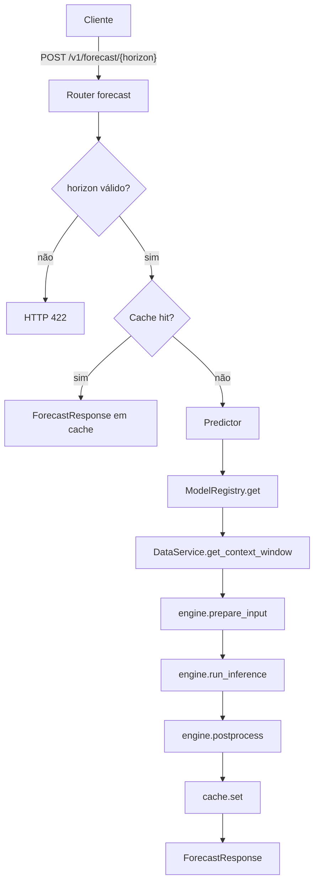

# API de Serving — WeatherOps

API REST assíncrona para servir modelos de previsão meteorológica TFT e N-BEATS
carregados do MLflow Model Registry. Construída com FastAPI, expõe previsões
horárias de temperatura para horizontes de 72, 168 e 336 horas.

## Documentos Relacionados

- Treinamento de modelos: `src/ml_workstation/README.md`
- Promoção para produção: `src/ml_workstation/promotion/PROMOTION.md`
- Guia de desenvolvimento: `docs/DEVELOPMENT_SETUP.md`

## Estrutura

```text
src/api/
├── main.py                  # Fábrica da aplicação FastAPI e lifespan (startup/shutdown)
├── config.py                # REGISTERED_MODELS, ServingModelConfig, Settings
├── cache.py                 # Cache TTL em memória ou Redis
├── dependencies.py          # Injetores de dependência FastAPI
├── tracing.py               # Middleware X-Trace-Id + configuração OpenTelemetry
├── Dockerfile               # Imagem de serving (Python 3.12-slim + Poetry)
├── docker-compose.yml       # Serviços: weatherops-api, mlflow-ui, otel-collector
├── engines/
│   ├── base.py              # BaseInferenceEngine (interface abstrata) + InferenceContext
│   ├── pytorch_forecasting.py  # Engine TFT/N-BEATS (TimeSeriesDataSet + model.predict)
│   └── sequential.py        # Engine LSTM/Transformer (tensor normalizado por StandardScaler)
├── routers/
│   ├── forecast.py          # POST /v1/forecast/{horizon}
│   └── health.py            # GET /health  |  GET /health/ready
├── schemas/
│   ├── common.py            # ForecastPoint, ErrorResponse
│   └── forecast.py          # ForecastRequest, ForecastResponse
└── services/
    ├── data_service.py      # Carrega Parquet em memória e serve janelas de contexto
    ├── model_registry.py    # Carrega e mantém ModelEntry por chave (ex.: "tft_72")
    └── predictor.py         # Orquestra uma requisição de inferência de ponta a ponta
```

## Fluxo de uma Requisição



## Endpoints

### `GET /health`

Probe de liveness. Retorna `200 OK` enquanto o processo estiver em execução.
Usado por orquestradores de contêiner para decidir se o pod deve ser reiniciado.

```json
{"status": "ok"}
```

---

### `GET /health/ready`

Probe de readiness. Retorna `200` apenas quando todos os modelos foram carregados
e o DataService está populado. Usado por balanceadores de carga.

| Código | Significado |
|---|---|
| `200` | Pronto — todos os modelos carregados com sucesso |
| `207` | Degradado — ao menos um modelo falhou ao carregar |
| `503` | Carregando — startup ainda em progresso |

Exemplo de resposta `200`:

```json
{
  "status": "pronto",
  "data_service": "pronto",
  "models_loaded": ["tft_72", "tft_168", "tft_336", "nbeats_72"],
  "models_failed": [],
  "row_count": 87648
}
```

---

### `POST /v1/forecast/{horizon}`

Previsão horária de temperatura: devolve `horizon` pontos (uma hora cada), começando na hora imediatamente seguinte ao instante de referência.

**Parâmetro de path**

| Parâmetro | Tipo | Valores válidos |
|---|---|---|
| `horizon` | `int` | `72`, `168`, `336` |

**Corpo da requisição**

Podes enviar `reference_date` só com a data (meia-noite desse dia) ou com data e hora em ISO 8601:

```json
{
  "reference_date": "2024-06-01",
  "model_type": "tft",
  "group_id": "station_1"
}
```

```json
{
  "reference_date": "2024-06-01T14:30:00",
  "model_type": "tft",
  "group_id": "station_1"
}
```

| Campo | Tipo | Padrão | Descrição |
|---|---|---|---|
| `reference_date` | data (`YYYY-MM-DD`) ou data/hora ISO | — | Último instante do histórico a considerar (inclusivo); a primeira previsão é `reference_date + 1h`. A API monta internamente a janela de contexto até este momento. |
| `model_type` | `"tft"` \| `"nbeats"` | `"tft"` | Família de modelo a usar |
| `group_id` | `string` | `"station_1"` | Identificador da estação meteorológica |

**Resposta `200`**

```json
{
  "reference_date": "2024-06-01T00:00:00",
  "horizon": 72,
  "model_type": "tft",
  "model_version": "3",
  "mape": 2.47,
  "predictions": [
    {"timestamp": "2024-06-01T01:00:00", "temp_ar_c": 23.1},
    {"timestamp": "2024-06-01T02:00:00", "temp_ar_c": 22.8}
  ],
  "latency_ms": 148.5
}
```

| Código | Descrição |
|---|---|
| `200` | Previsão gerada com sucesso |
| `404` | Modelo não carregado (não promovido para produção no MLflow) |
| `422` | Horizonte inválido, `reference_date` inválido ou dados insuficientes antes do instante de referência |
| `500` | Erro interno de inferência |

A documentação interativa completa está disponível em `http://localhost:8888/docs`.

## Variáveis de Ambiente

Todas as variáveis são lidas por `config.Settings` (Pydantic Settings). Podem ser
passadas diretamente ou via arquivo `.env` na raiz do projeto.

| Variável | Padrão | Descrição |
|---|---|---|
| `MLFLOW_TRACKING_URI` | — | URI do MLflow (ex.: `file:///app/mlruns` ou URL remota) |
| `WEATHEROPS_MODEL_ROOT` | — | Diretório com modelos exportados pelo `promote` (ex.: `/app/ml_models` no Docker). Se existir `<root>/<experiment_name>/` com `MLmodel`, a API carrega daqui antes do Registry. |
| `PARQUET_PATH` | `/app/data/spec` | Caminho para arquivo ou diretório de arquivos Parquet |
| `DEVICE` | `cpu` | Dispositivo de inferência: `cpu` ou `cuda` |
| `CACHE_BACKEND` | `memory` | Backend do cache: `memory` (padrão) ou `redis` |
| `CACHE_TTL_SECONDS` | `3600` | Tempo de vida das entradas no cache (segundos) |
| `REDIS_URL` | `redis://localhost:6379` | URL de conexão Redis (apenas quando `CACHE_BACKEND=redis`) |
| `OTEL_EXPORTER_OTLP_ENDPOINT` | — | Endpoint OTLP HTTP (ex.: `http://otel-collector:4318`); deixe vazio para desativar |
| `OTEL_SERVICE_NAME` | `weatherops-api` | Nome do serviço exibido no coletor OTel |

## Como Executar

Todos os comandos abaixo devem ser executados na raiz do repositório (`WeatherOps/`).

Subir apenas a API:

```bash
docker compose -f src/api/docker-compose.yml --profile api up --build weatherops-api
```

Subir a API e a UI do MLflow:

```bash
docker compose -f src/api/docker-compose.yml --profile api up -d
```

A API fica em `http://localhost:8888`. A UI do MLflow usa `http://localhost:5001` (mapeamento `5001:5000` no host).

Verificar se a API está pronta:

```bash
curl http://localhost:8888/health/ready
```

Executar uma previsão TFT de 72 horas:

```bash
curl -X POST http://localhost:8888/v1/forecast/72 \
  -H "Content-Type: application/json" \
  -d '{"reference_date": "2024-06-01", "model_type": "tft", "group_id": "station_1"}'
```

Acessar a documentação interativa:

```
http://localhost:8888/docs
```

## Adicionando um Novo Modelo

Para registrar um novo modelo na API, adicione uma entrada em `REGISTERED_MODELS`
em `config.py`. Nenhuma outra alteração é necessária.

```python
# src/api/config.py

REGISTERED_MODELS: list[ServingModelConfig] = [
    # ... modelos existentes ...
    ServingModelConfig(
        key="lstm_72",
        experiment_name="weather_lstm_h72",  # deve corresponder ao nome no MLflow Registry
        model_type="lstm",
        horizon=72,
        sequence_length=168,
        engine_class="sequential",           # "pytorch_forecasting" para TFT/N-BEATS
    ),
]
```

Para adicionar um novo horizonte, basta registrar o modelo acima — `VALID_HORIZONS`
é derivado automaticamente dos modelos registrados.

Para adicionar um novo tipo de modelo, inclua também o literal em `ModelType`
em `schemas/forecast.py`:

```python
ModelType = Literal["tft", "nbeats", "lstm"]
```

## Cache

O cache evita recomputação de previsões idênticas dentro do TTL configurado.
A chave é derivada de `(model_type, horizon, reference_date, group_id)`.

Ativar Redis:

```bash
CACHE_BACKEND=redis REDIS_URL=redis://localhost:6379 docker compose ...
```

O backend padrão (em memória) é adequado para implantações de processo único.
Para múltiplos workers ou pods, use Redis para compartilhar estado.

## Rastreamento (Observabilidade)

Todo response carrega o cabeçalho `X-Trace-Id` (UUID por requisição), ativo
independentemente de configuração — útil para correlação de logs.

Para habilitar o rastreamento completo via OpenTelemetry, instale os pacotes
opcionais e defina o endpoint:

```bash
pip install opentelemetry-sdk \
            opentelemetry-instrumentation-fastapi \
            opentelemetry-exporter-otlp-proto-http

OTEL_EXPORTER_OTLP_ENDPOINT=http://otel-collector:4318 docker compose ...
```

O coletor OTel está comentado em `docker-compose.yml` e pode ser ativado
descomentando o serviço `otel-collector`.

## Dependências

| Pacote | Uso |
|---|---|
| `fastapi` | Framework web assíncrono |
| `uvicorn` | Servidor ASGI |
| `pydantic-settings` | Leitura de configurações via variáveis de ambiente |
| `mlflow` | Carregamento de modelos do Model Registry |
| `pytorch-forecasting` | Modelos TFT e N-BEATS (engine `pytorch_forecasting`) |
| `torch` | Inferência PyTorch (ambos os engines) |
| `pandas` / `pyarrow` | Leitura de Parquet e manipulação de janelas de contexto |
| `redis` | Backend de cache Redis (opcional; `pip install redis`) |
| `opentelemetry-sdk` | Rastreamento distribuído (opcional) |
