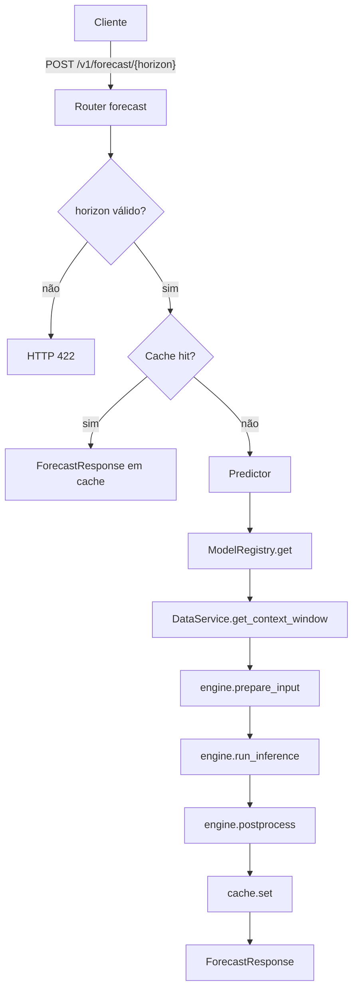

# API de Serving — WeatherOps

API REST assíncrona para servir modelos de previsão meteorológica TFT e N-BEATS
carregados do MLflow Model Registry. Construída com FastAPI, expõe previsões
horárias de temperatura para horizontes de 72, 168 e 336 horas.

Opcionalmente, com `GEMINI_API_KEY` e dependências do grupo Poetry `agent`, o router
`POST /v1/agent/chat` expõe um assistente (Gemini + LangGraph + RAG BM25) documentado em
`../../docs/agent_benchmark.md` e `../api_agent/`.

## Smoke (HTTP contra API em execução)

Com a API no ar (`uvicorn` ou `docker compose --profile api`), defina `WEATHEROPS_API_BASE_URL` (ex. `http://127.0.0.1:8888`) e rode na raiz do repositório: `python scripts/smoke_api.py`. Opcional: `SMOKE_REFERENCE_DATE`, `SMOKE_FORECAST_HORIZON`, `SMOKE_SKIP_AGENT=1`. Teste pytest equivalente: `pytest test/integration/test_live_api_smoke.py -m live_api -s`.

## Documentos Relacionados

- Treinamento de modelos: `../ml_workstation/README.md`
- Promoção para produção: `../ml_workstation/promotion/PROMOTION.md`

## Estrutura

```text
src/api/
├── main.py                  # Fábrica da aplicação FastAPI e lifespan (startup/shutdown)
├── config.py                # REGISTERED_MODELS, ServingModelConfig, Settings
├── cache.py                 # Cache TTL em memória ou Redis
├── dependencies.py          # Injetores de dependência FastAPI
├── metrics.py               # Instrumentação Prometheus (expõe /metrics)
├── prometheus.yml           # Configuração de scrape do Prometheus
├── Dockerfile               # Imagem de serving (Python 3.12-slim + Poetry)
├── docker-compose.yml       # Serviços: weatherops-api, mlflow-ui, prometheus, grafana
├── grafana/
│   └── provisioning/
│       ├── datasources/
│       │   └── prometheus.yml  # Datasource Prometheus provisionado automaticamente
│       └── dashboards/
│           └── weatherops.json # Dashboard API + qualidade do modelo
├── engines/
│   ├── base.py              # BaseInferenceEngine (interface abstrata) + InferenceContext
│   ├── pytorch_forecasting.py  # Engine TFT/N-BEATS (TimeSeriesDataSet + model.predict)
│   └── sequential.py        # Engine LSTM/Transformer (tensor normalizado por StandardScaler)
├── routers/
│   ├── forecast.py          # POST /v1/forecast/{horizon}
│   └── health.py            # GET /health  |  GET /health/ready
├── schemas/
│   ├── common.py            # ForecastPoint, ErrorResponse
│   └── forecast.py          # ForecastRequest, ForecastResponse
└── services/
    ├── accuracy_evaluator.py  # Avalia MAE/RMSE/MAPE em background
    ├── data_service.py      # Carrega Parquet em memória e serve janelas de contexto
    ├── model_registry.py    # Carrega e mantém ModelEntry por chave (ex.: "tft_72")
    ├── prediction_logger.py # Persiste prediction_log e accuracy_log em SQLite
    └── predictor.py         # Orquestra uma requisição de inferência de ponta a ponta
```

## Fluxo de uma Requisição



## Endpoints

### `GET /health`

Probe de liveness. Retorna `200 OK` enquanto o processo estiver em execução.
Usado por orquestradores de contêiner para decidir se o pod deve ser reiniciado.

```json
{"status": "ok"}
```

---

### `GET /health/ready`

Probe de readiness. Retorna `200` apenas quando todos os modelos foram carregados
e o DataService está populado. Usado por balanceadores de carga.

| Código | Significado |
|---|---|
| `200` | Pronto — todos os modelos carregados com sucesso |
| `207` | Degradado — ao menos um modelo falhou ao carregar |
| `503` | Carregando — startup ainda em progresso |

Exemplo de resposta `200`:

```json
{
  "status": "pronto",
  "data_service": "pronto",
  "models_loaded": ["tft_72", "tft_168", "tft_336", "nbeats_72"],
  "models_failed": [],
  "row_count": 87648
}
```

---

### `POST /v1/forecast/{horizon}`

Previsão horária de temperatura: devolve `horizon` pontos (uma hora cada), começando na hora imediatamente seguinte ao instante de referência.

**Parâmetro de path**

| Parâmetro | Tipo | Valores válidos |
|---|---|---|
| `horizon` | `int` | `72`, `168`, `336` |

**Corpo da requisição**

Podes enviar `reference_date` só com a data (meia-noite desse dia) ou com data e hora em ISO 8601:

```json
{
  "reference_date": "2024-06-01",
  "model_type": "tft",
  "group_id": "station_1"
}
```

```json
{
  "reference_date": "2024-06-01T14:30:00",
  "model_type": "tft",
  "group_id": "station_1"
}
```

| Campo | Tipo | Padrão | Descrição |
|---|---|---|---|
| `reference_date` | data (`YYYY-MM-DD`) ou data/hora ISO | — | Último instante do histórico a considerar (inclusivo); a primeira previsão é `reference_date + 1h`. A API monta internamente a janela de contexto até este momento. |
| `model_type` | `"tft"` \| `"nbeats"` | `"tft"` | Família de modelo a usar |
| `group_id` | `string` | `"station_1"` | Identificador da estação meteorológica |

**Resposta `200`**

```json
{
  "reference_date": "2024-06-01T00:00:00",
  "horizon": 72,
  "model_type": "tft",
  "model_version": "3",
  "mape": 2.47,
  "predictions": [
    {"timestamp": "2024-06-01T01:00:00", "temp_ar_c": 23.1},
    {"timestamp": "2024-06-01T02:00:00", "temp_ar_c": 22.8}
  ],
  "latency_ms": 148.5
}
```

| Código | Descrição |
|---|---|
| `200` | Previsão gerada com sucesso |
| `404` | Modelo não carregado (não promovido para produção no MLflow) |
| `422` | Horizonte inválido, `reference_date` inválido ou dados insuficientes antes do instante de referência |
| `500` | Erro interno de inferência |

A documentação interativa completa está disponível em `http://localhost:8888/docs`.

### Endpoints da API

| Endpoint | Método | Descrição |
|---|---|---|
| `/health` | GET | Probe de liveness — retorna `200` enquanto o processo estiver ativo |
| `/health/ready` | GET | Probe de readiness — `200` quando todos os modelos estão carregados |
| `/v1/forecast/72` | POST | Previsão de temperatura para 72 horas |
| `/v1/forecast/168` | POST | Previsão de temperatura para 168 horas (7 dias) |
| `/v1/forecast/336` | POST | Previsão de temperatura para 336 horas (14 dias) |
| `/metrics` | GET | Métricas Prometheus (coletadas automaticamente pelo Prometheus) |
| `/docs` | GET | Documentação interativa Swagger UI |
| `/redoc` | GET | Documentação alternativa ReDoc |

## Variáveis de Ambiente

Todas as variáveis são lidas por `config.Settings` (Pydantic Settings). Podem ser
passadas diretamente ou via arquivo `.env` na raiz do projeto.

| Variável | Padrão | Descrição |
|---|---|---|
| `MLFLOW_TRACKING_URI` | — | URI do MLflow (ex.: `file:///app/mlruns` ou URL remota) |
| `WEATHEROPS_MODEL_ROOT` | — | Diretório com modelos exportados pelo `promote` (ex.: `/app/ml_models` no Docker). Se existir `<root>/<experiment_name>/` com `MLmodel`, a API carrega daqui antes do Registry. |
| `PARQUET_PATH` | `/app/data/spec` | Caminho para arquivo ou diretório de arquivos Parquet |
| `DEVICE` | `cpu` | Dispositivo de inferência: `cpu` ou `cuda` |
| `CACHE_BACKEND` | `memory` | Backend do cache: `memory` (padrão) ou `redis` |
| `CACHE_TTL_SECONDS` | `3600` | Tempo de vida das entradas no cache (segundos) |
| `REDIS_URL` | `redis://localhost:6379` | URL de conexão Redis (apenas quando `CACHE_BACKEND=redis`) |
| `ACCURACY_DB_PATH` | `/app/data/accuracy.db` | Banco SQLite com histórico de previsões e avaliações de acurácia |
| `ACCURACY_EVAL_INTERVAL_SECONDS` | `3600` | Intervalo do worker que calcula MAE/RMSE/MAPE das previsões avaliáveis |

## Como Executar

Todos os comandos abaixo devem ser executados na raiz do repositório (`WeatherOps/`).

Subir apenas a API:

```bash
docker compose -f src/api/docker-compose.yml --profile api up --build weatherops-api
```

Subir a API e a UI do MLflow:

```bash
docker compose -f src/api/docker-compose.yml --profile api up -d
```

A API fica em `http://localhost:8888`. A UI do MLflow usa `http://localhost:5001` (mapeamento `5001:5000` no host).

Verificar se a API está pronta:

```bash
curl http://localhost:8888/health/ready
```

Executar uma previsão TFT de 72 horas:

```bash
curl -X POST http://localhost:8888/v1/forecast/72 \
  -H "Content-Type: application/json" \
  -d '{"reference_date": "2024-06-01", "model_type": "tft", "group_id": "station_1"}'
```

Acessar a documentação interativa:

```
http://localhost:8888/docs
```

## Adicionando um Novo Modelo

Para registrar um novo modelo na API, adicione uma entrada em `REGISTERED_MODELS`
em `config.py`. Nenhuma outra alteração é necessária.

```python
# src/api/config.py

REGISTERED_MODELS: list[ServingModelConfig] = [
    # ... modelos existentes ...
    ServingModelConfig(
        key="lstm_72",
        experiment_name="weather_lstm_h72",  # deve corresponder ao nome no MLflow Registry
        model_type="lstm",
        horizon=72,
        sequence_length=168,
        engine_class="sequential",           # "pytorch_forecasting" para TFT/N-BEATS
    ),
]
```

Para adicionar um novo horizonte, basta registrar o modelo acima — `VALID_HORIZONS`
é derivado automaticamente dos modelos registrados.

Para adicionar um novo tipo de modelo, inclua também o literal em `ModelType`
em `schemas/forecast.py`:

```python
ModelType = Literal["tft", "nbeats", "lstm"]
```

## Cache

O cache evita recomputação de previsões idênticas dentro do TTL configurado.
A chave é derivada de `(model_type, horizon, reference_date, group_id)`.

Ativar Redis:

```bash
CACHE_BACKEND=redis REDIS_URL=redis://localhost:6379 docker compose ...
```

O backend padrão (em memória) é adequado para implantações de processo único.
Para múltiplos workers ou pods, use Redis para compartilhar estado.

## Monitoramento (Prometheus + Grafana)

A API é instrumentada automaticamente via `prometheus-fastapi-instrumentator`.
O endpoint `/metrics` expõe métricas no formato Prometheus sem nenhuma configuração adicional.
Além das métricas HTTP, a API registra latência de inferência, uso de cache e
qualidade do modelo em produção.

### Métricas expostas

| Métrica | Tipo | Descrição |
|---|---|---|
| `http_requests_total` | Counter | Total de requisições por rota, método e status HTTP |
| `http_request_duration_highr_seconds` | Histogram | Latência com muitos buckets (ideal para percentis p95/p99) |
| `http_request_duration_seconds` | Histogram | Latência com poucos buckets, agrupada por handler |
| `http_requests_in_progress` | Gauge | Requisições sendo processadas no momento |
| `weatherops_inference_duration_seconds` | Histogram | Latência de inferência por `model_key` |
| `weatherops_cache_hits_total` | Counter | Respostas servidas diretamente do cache |
| `weatherops_cache_misses_total` | Counter | Requisições que exigiram nova inferência |
| `weatherops_model_mae` | Gauge | MAE por `model_key` e bucket de horizonte |
| `weatherops_model_rmse` | Gauge | RMSE por `model_key` e bucket de horizonte |
| `weatherops_model_mape` | Gauge | MAPE por `model_key` e bucket de horizonte |

### Monitoramento de qualidade do modelo

Em cache miss, o endpoint de forecast registra a previsão em background no
`PredictionLogger`. O `AccuracyEvaluator` roda periodicamente, busca previsões
cujo horizonte já transcorreu, consulta os valores reais no Parquet via
`DataService`, calcula MAE/RMSE/MAPE e atualiza os gauges Prometheus.

Os buckets usados para análise são:

| Bucket | Intervalo |
|---|---|
| `near` | horas 1 a 24 |
| `mid` | horas 25 a 72 |
| `far` | horas 73 em diante |

As métricas `weatherops_model_*` aparecem somente quando há previsões
avaliáveis e dados reais correspondentes em `data/spec`.

### Subindo o stack completo

```bash
# A partir da raiz do repositório
docker compose -f src/api/docker-compose.yml --profile api up -d
```

Isso sobe a API, o Prometheus e o Grafana juntos.

| Serviço | URL | Credenciais |
|---|---|---|
| Prometheus | `http://localhost:9090` | — |
| Grafana | `http://localhost:3000` | admin / admin |

O datasource do Prometheus é provisionado automaticamente no Grafana ao subir o container.

### Queries PromQL para dashboards

```promql
# Throughput de requisições por segundo (última 1 min)
rate(http_requests_total[1m])

# Latência p95 (última 5 min)
histogram_quantile(
  0.95,
  sum by (le) (rate(http_request_duration_highr_seconds_bucket{job="weatherops-api"}[5m]))
)

# Requisições simultâneas em andamento
http_requests_in_progress

# Taxa de erros (status 5xx)
rate(http_requests_total{status=~"5.."}[1m])

# MAPE por modelo e bucket
weatherops_model_mape{job="weatherops-api"}

# Latência de inferência p95 por modelo
histogram_quantile(
  0.95,
  sum by (model_key, le) (rate(weatherops_inference_duration_seconds_bucket{job="weatherops-api"}[5m]))
)
```

### Verificar métricas diretamente

```bash
curl http://localhost:8888/metrics
```

## Dependências

| Pacote | Uso |
|---|---|
| `fastapi` | Framework web assíncrono |
| `uvicorn` | Servidor ASGI |
| `pydantic-settings` | Leitura de configurações via variáveis de ambiente |
| `mlflow` | Carregamento de modelos do Model Registry |
| `pytorch-forecasting` | Modelos TFT e N-BEATS (engine `pytorch_forecasting`) |
| `torch` | Inferência PyTorch (ambos os engines) |
| `pandas` / `pyarrow` | Leitura de Parquet e manipulação de janelas de contexto |
| `redis` | Backend de cache Redis (opcional; `pip install redis`) |
| `prometheus-fastapi-instrumentator` | Instrumentação automática de métricas HTTP |
