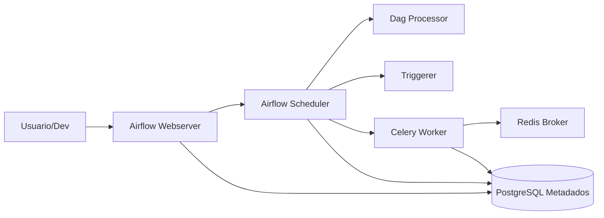

# Data Airflow Architecture

Arquitetura da stack Airflow usada no WeatherOps.

## Topologia

## Servicos Principais

- `airflow-webserver`: UI, API e controle operacional.
- `airflow-scheduler`: agenda e dispara tarefas.
- `airflow-worker`: executa tarefas via Celery.
- `airflow-dag-processor`: parse e serializacao de DAGs.
- `airflow-triggerer`: suporte a operadores deferrable.
- `postgres`: banco de metadados do Airflow.
- `redis`: broker de filas do Celery.

## Executor

- Executor configurado: `CeleryExecutor`.
- Broker: Redis.
- Result backend: PostgreSQL.

## Dependencias de Inicializacao

`airflow-init` prepara diretorios, aplica migracoes e cria usuario admin.

Fluxo recomendado:
1. `up airflow-init`
2. `up -d`

## Acoplamento com codigo do repositorio

Os volumes incluem `core`, `src` e `data`, permitindo que DAGs importem modulos internos e operem sobre os dados versionados no repositorio.

## Limites atuais

- Configuracao atual e voltada a ambiente local.
- Falta camada dedicada de secrets management para producao.
- Escalabilidade depende de tuning de worker e fila.
