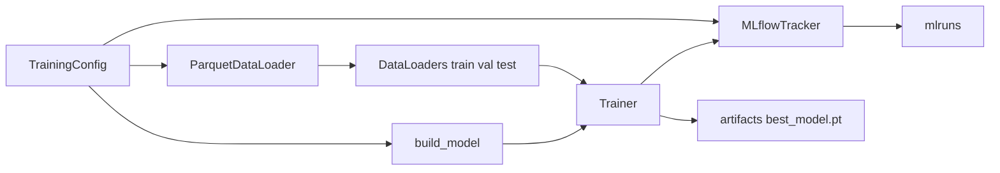
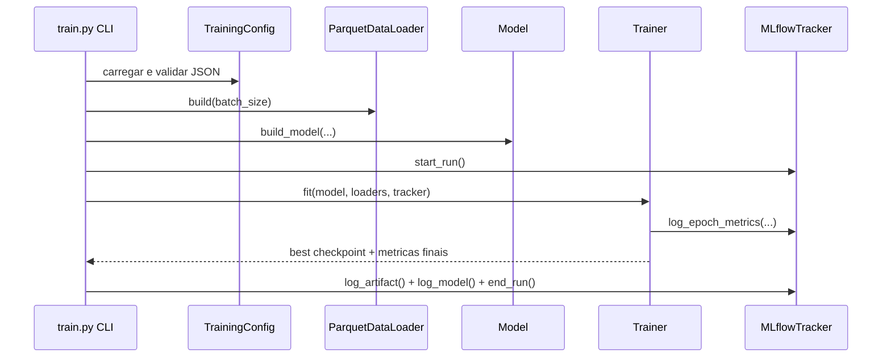

# ML Workstation Architecture

Arquitetura tecnica do modulo de treinamento e avaliacao de series temporais.

## Visao Geral

O entrypoint `train.py` orquestra quatro camadas: configuracao, dados, modelo e tracking.

## Camadas

## 1. Configuracao (`config/training_config.py`)

- Define `TrainingConfig`, `DataConfig`, `ModelConfig` e bloco de governanca.
- Valida JSON de experimento antes da execucao.
- Centraliza hiperparametros, paths e device.

## 2. Dados (`data/`)

- `loader.py`: leitura de Parquet, split temporal, normalizacao e DataLoaders.
- `dataset.py`: gera janelas de sequencia (`X`) e horizonte alvo (`y`).

Contrato principal:
- Entrada: dados tabulares em `data/spec`.
- Saida: batches PyTorch com shape compativel com modelos seq2one/seq2seq curto.

## 3. Modelos (`models/`)

- `WeatherLSTM`: encoder recorrente para dinamica temporal local.
- `WeatherTransformer`: encoder com self-attention para dependencias mais longas.
- Factory de construcao escolhe modelo via `model_type`.

Interface de saida esperada:
- Tensor com dimensoes `batch x horizon x n_targets`.

## 4. Treinamento (`training/`)

- Loop de treino e validacao por epoca.
- Early stopping por `val_loss`.
- Salvamento do melhor checkpoint em `artifacts`.
- Calculo de metricas de regressao (MAE, RMSE, MAPE).

## 5. Tracking (`tracking/mlflow_tracker.py`)

- Abstrai chamadas do MLflow.
- Loga configuracao completa, metricas por epoca, artefatos e modelo.
- Registra governanca em tags e parametros.

## 6. Avaliacao (`evaluation/`)

- Reconstroi configuracao por `run_id`.
- Carrega modelo do MLflow, com fallback para checkpoint local quando necessario.
- Executa inferencia no teste e gera HTML real vs predito.

## Sequencia de Execucao

## Acoplamentos Criticos

1. Schema de `data/spec` precisa bater com `feature_columns` dos JSONs.
2. Formato de checkpoint precisa permanecer compativel com avaliacao.
3. Paths de volume no Docker devem refletir os caminhos esperados no runtime.

## Decisoes Operacionais Atuais

1. Configuracoes de experimento usam `"device": "cuda"`.
2. Treino containerizado usa perfis separados para CPU e GPU.
3. MLflow local em `mlruns` para reproducibilidade no workspace.
