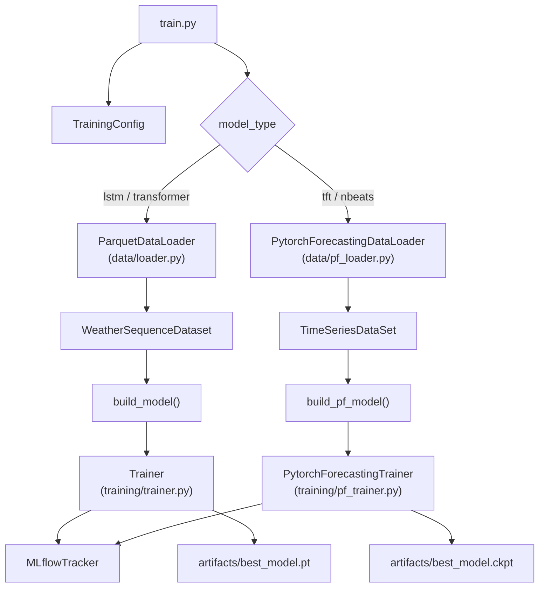
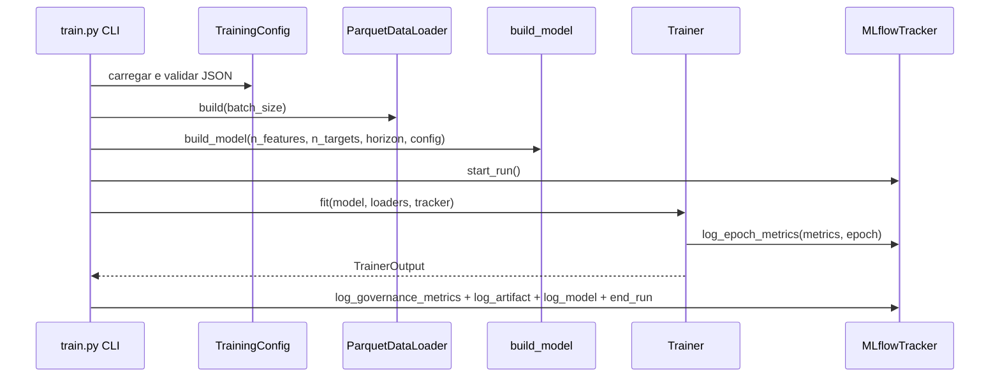
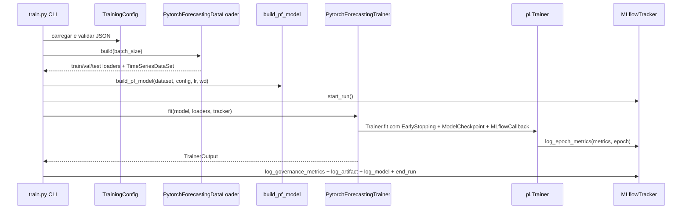

# ML Workstation Architecture

Arquitetura tecnica do modulo de treinamento e avaliacao de series temporais.

## Visao Geral

O entrypoint `train.py` orquestra quatro camadas — configuracao, dados, modelo e tracking — com dois caminhos de execucao distintos baseados no `model_type`.

## Camadas

## 1. Configuracao (`config/training_config.py`)

- Define `TrainingConfig`, `DataConfig`, `ModelConfig` e bloco de governanca.
- Valida JSON de experimento antes da execucao.
- Centraliza hiperparametros, paths e device.

`ModelConfig.model_type` aceita: `"lstm"`, `"transformer"`, `"tft"`, `"nbeats"`.

Campos especificos por modelo:

| Campo | Modelos | Descricao |
|---|---|---|
| `hidden_size` | todos | Dimensao oculta / tamanho de bloco |
| `num_layers` | lstm, transformer | Camadas empilhadas |
| `num_heads` | transformer | Cabecas de atencao multi-head |
| `ffn_dim` | transformer | Dimensao feedforward |
| `attention_head_size` | tft | Tamanho de cada cabeca de atencao TFT |
| `hidden_continuous_size` | tft | Projecao de variaveis continuas |
| `num_stacks` | nbeats | Numero de stacks |
| `num_blocks` | nbeats | Blocos por stack |
| `num_block_layers` | nbeats | Camadas FC por bloco |
| `backcast_loss_ratio` | nbeats | Peso do backcast loss |

## 2. Dados (`data/`)

### Caminho LSTM/Transformer — `loader.py` + `dataset.py`

- `ParquetDataLoader`: leitura de Parquet, split temporal, `StandardScaler` ajustado so no treino, `DataLoader` PyTorch.
- `WeatherSequenceDataset`: janelas deslizantes — `X` shape `(seq_len, n_features)`, `y` shape `(horizon, n_targets)`.

### Caminho TFT/NBEATS — `pf_loader.py`

- `PytorchForecastingDataLoader`: leitura do mesmo Parquet, split temporal identico (sem data-leakage), construcao de `TimeSeriesDataSet`.
- Adiciona colunas obrigatorias: `time_idx` (inteiro sequencial) e `group` (constante `"station_1"` para estacao unica).
- Classifica features automaticamente:
  - `time_varying_known_reals`: `["hora_sin", "hora_cos"]` — valores conhecidos para qualquer horizonte futuro.
  - `time_varying_unknown_reals`: todas as demais features (temperatura, umidade, pressao, lags, medias moveis).
- `val_dataset` e `test_dataset` criados com `TimeSeriesDataSet.from_dataset()`, garantindo normalizacao consistente com o treino.

## 3. Modelos (`models/`)

### Modelos PyTorch puros — `ITimeSeriesModel`

Contrato definido em `interface.py`:
- Entrada: `(batch, seq_len, n_features)`
- Saida: `(batch, horizon, n_targets)`

| Classe | Arquivo | Arquitetura |
|---|---|---|
| `WeatherLSTM` | `lstm.py` | LSTM empilhado → Linear |
| `WeatherTransformer` | `transformer.py` | Input proj → PositionalEncoding → TransformerEncoder → mean-pool → Linear |

Factory: `build_model(n_features, n_targets, horizon, config) -> ITimeSeriesModel`

### Modelos pytorch-forecasting — `LightningModule`

TFT e NBEATS sao `LightningModule` e **nao implementam** `ITimeSeriesModel`. Sao instanciados a partir do `TimeSeriesDataSet` de treino, que define automaticamente as dimensoes de entrada/saida.

| Classe | Arquivo | Biblioteca | Referencia |
|---|---|---|---|
| `WeatherTFT` | `tft.py` | `TemporalFusionTransformer` | Lim et al., 2021 |
| `WeatherNBEATS` | `nbeats.py` | `NBeats` | Oreshkin et al., 2020 |

Factory: `build_pf_model(dataset, config, learning_rate, weight_decay) -> LightningModule`

O TFT usa covariáveis (known/unknown reals). O NBEATS e puramente univariado — usa apenas o alvo como serie de entrada.

## 4. Treinamento (`training/`)

### `Trainer` — loop manual PyTorch (`trainer.py`)

- Loop por epoca com `_train_epoch()` e `_validate()`.
- Early stopping por `val_loss` com `patience` configuravel.
- Salva `best_model.pt` via `torch.save(model.state_dict())`.
- Calcula metricas de regressao: MAE, RMSE, MAPE (na escala original quando scaler disponivel).

### `PytorchForecastingTrainer` — PyTorch Lightning (`pf_trainer.py`)

- Usa `pl.Trainer` com dois callbacks:
  - `EarlyStopping(monitor="val_loss", patience=config.early_stopping_patience)`
  - `ModelCheckpoint(monitor="val_loss", save_top_k=1)` — salva `best_model.ckpt`
- `_MLflowEpochCallback`: callback Lightning customizado que encaminha metricas de cada epoca ao `MLflowTracker.log_epoch_metrics()`.
- Mapeamento de device: `"cuda"` → `accelerator="gpu"`, `"mps"` → `accelerator="mps"`, demais → `accelerator="cpu"`.
- Retorna `TrainerOutput` — o mesmo Pydantic model do `Trainer` convencional, garantindo compatibilidade com a stack de avaliacao e promocao.

## 5. Tracking (`tracking/mlflow_tracker.py`)

- Abstrai chamadas do MLflow; reutilizado por ambos os trainers sem alteracoes.
- Loga configuracao completa, metricas por epoca, artefatos e modelo PyTorch.
- Registra governanca em tags e parametros.

## 6. Avaliacao (`evaluation/`)

- Reconstroi configuracao por `run_id`.
- Carrega modelo do MLflow, com fallback para checkpoint local quando necessario.
- Executa inferencia no teste e gera HTML real vs predito.
- Suporte atual: apenas modelos LSTM e Transformer (`ITimeSeriesModel`). Ver `evaluation/README.md`.

## Diagramas de Sequencia

### Caminho LSTM / Transformer

### Caminho TFT / NBEATS

## Acoplamentos Criticos

1. Schema de `data/spec/<municipio>/` precisa bater com `feature_columns` dos JSONs de experimento.
2. Para TFT: `hora_sin` e `hora_cos` devem estar em `feature_columns` para serem classificados como `known_future_reals`; ausencia degrada o modelo.
3. Formato de checkpoint: LSTM/Transformer salvam `state_dict` em `.pt`; TFT/NBEATS salvam checkpoint Lightning em `.ckpt`.
4. Paths de volume no Docker: `data/spec` e montado como arvore inteira (`../../data/spec:/app/data/spec:ro`), portanto subpastas por municipio ficam disponíveis automaticamente em `/app/data/spec/<municipio>`. O `parquet_path` no JSON de experimento deve apontar para a subpasta do municipio desejado (ex: `/app/data/spec/salvador`).
5. O `TimeSeriesDataSet` de validacao/teste deve ser criado com `from_dataset()` a partir do dataset de treino para garantir normalizacao consistente.

## Decisoes Operacionais Atuais

1. Configuracoes de experimento usam `"device": "cuda"`.
2. Treino containerizado usa perfis separados para CPU e GPU.
3. MLflow local em `mlruns` para reproducibilidade no workspace.
4. TFT e NBEATS usam `MAE` e `SMAPE` respectivamente como funcao de loss interna do pytorch-forecasting.
