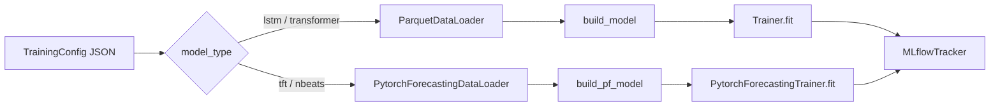

# ML Workstation

Modulo de treinamento, tracking e avaliacao de modelos de series temporais com PyTorch + MLflow.

Suporta quatro arquiteturas: LSTM, Transformer, Temporal Fusion Transformer (TFT) e N-BEATS.
LSTM e Transformer usam loop de treinamento manual PyTorch; TFT e N-BEATS usam pytorch-forecasting + PyTorch Lightning.

## Documentos Principais

- Arquitetura: `src/ml_workstation/ARCHITECTURE.md`
- Avaliacao: `src/ml_workstation/evaluation/README.md`
- Promocao: `src/ml_workstation/promotion/PROMOTION.md`

## Estrutura

```text
src/ml_workstation/
├── config/
│   └── training_config.py    # TrainingConfig, DataConfig, ModelConfig, GovernanceConfig
├── data/
│   ├── dataset.py            # WeatherSequenceDataset (janelas deslizantes para LSTM/Transformer)
│   ├── loader.py             # ParquetDataLoader (LSTM/Transformer)
│   └── pf_loader.py          # PytorchForecastingDataLoader (TFT/NBEATS -> TimeSeriesDataSet)
├── models/
│   ├── interface.py          # ITimeSeriesModel (contrato LSTM/Transformer)
│   ├── lstm.py               # WeatherLSTM
│   ├── transformer.py        # WeatherTransformer
│   ├── tft.py                # WeatherTFT (TemporalFusionTransformer factory)
│   └── nbeats.py             # WeatherNBEATS (NBeats factory)
├── training/
│   ├── metrics.py            # compute_metrics, compute_mape
│   ├── trainer.py            # Trainer — loop manual PyTorch (LSTM/Transformer)
│   └── pf_trainer.py         # PytorchForecastingTrainer — pl.Trainer (TFT/NBEATS)
├── tracking/
│   └── mlflow_tracker.py     # MLflowTracker
├── evaluation/
│   ├── core.py
│   ├── mlflow_helpers.py
│   └── run_evaluation.py
├── experiments/
│   ├── lstm/                 # lstm_<horizonte>_v<versao>.json
│   ├── transformer/          # transformer_<horizonte>_v<versao>.json
│   ├── tft/                  # tft_<horizonte>_v<versao>.json
│   └── nbeats/               # nbeats_<horizonte>_v<versao>.json
├── promotion/
├── artifacts/                # checkpoints salvos
├── mlruns/                   # backend local do MLflow
├── Dockerfile
├── docker-compose.yml
└── train.py                  # entrypoint
```

## Fluxo de Execucao

O entrypoint `train.py` faz o dispatch baseado em `model.model_type`:



## Convencoes de Experimento

- Pastas: `experiments/lstm`, `experiments/transformer`, `experiments/tft`, `experiments/nbeats`.
- Padrao de nome: `<modelo>_<horizonte>_v<versao>.json`.
- Toda configuracao de experimento deve manter `"device": "cuda"`.
- Horizontes disponiveis: `h72` (3 dias), `h168` (7 dias), `h336` (14 dias).
- O campo `data.parquet_path` deve apontar para a subpasta do municipio em `data/spec/`:

```json
"data": {
  "parquet_path": "/app/data/spec/salvador"
}
```

Para treinar com um municipio diferente, altere `parquet_path` para a subpasta correspondente (ex: `/app/data/spec/recife`). Os municipios disponiveis sao os que possuem subpasta em `data/spec/`, gerada pela DAG `data_feature_engineering`.

## Dependencias

As dependencias abaixo sao instaladas automaticamente via `poetry install`:

| Pacote | Uso |
|---|---|
| `torch` | Loop manual (LSTM/Transformer) |
| `pytorch-forecasting` | Modelos TFT e NBEATS |
| `lightning` | `pl.Trainer` usado pelo PytorchForecastingTrainer |
| `mlflow` | Tracking de experimentos e model registry |

## Como Treinar

Todos os comandos abaixo devem ser executados em `src/ml_workstation`.

Build (CPU):

```bash
docker compose --profile train up --build trainer
```

Build (GPU)

```bash
docker compose --profile train-gpu up --build trainer-gpu
```

Treino smoke test (CPU):

```bash
docker compose --profile train run --rm trainer --config //app/experiments/lstm/lstm_smoke_test.json
```

Treino LSTM e Transformer (CPU):

```bash
docker compose --profile train run --rm trainer --config //app/experiments/lstm/lstm_h72_v1.json
docker compose --profile train run --rm trainer --config //app/experiments/transformer/transformer_h72_v1.json
```

Treino TFT (CPU):

```bash
docker compose --profile train run --rm trainer --config //app/experiments/tft/tft_h72_v1.json
docker compose --profile train run --rm trainer --config //app/experiments/tft/tft_h168_v1.json
docker compose --profile train run --rm trainer --config //app/experiments/tft/tft_h336_v1.json
```

Treino NBEATS (CPU):

```bash
docker compose --profile train run --rm trainer --config //app/experiments/nbeats/nbeats_h72_v1.json
docker compose --profile train run --rm trainer --config //app/experiments/nbeats/nbeats_h168_v1.json
docker compose --profile train run --rm trainer --config //app/experiments/nbeats/nbeats_h336_v1.json
```

Treino GPU (qualquer modelo):

```bash
docker compose --profile train-gpu run --rm trainer-gpu --config //app/experiments/tft/tft_h72_v1.json
docker compose --profile train-gpu run --rm trainer-gpu --config //app/experiments/nbeats/nbeats_h72_v1.json
```

Loop em lote — todos os horizontes TFT (GPU):

```bash
for h in h72 h168 h336; do
  for v in 1 2 3; do
    echo //app/experiments/tft/tft_${h}_v${v}.json
    docker compose --profile train-gpu run --rm trainer-gpu --config "//app/experiments/tft/tft_${h}_v${v}.json"
  done
done

for h in h72 h168 h336; do
  for v in 1 2 3; do
    echo //app/experiments/nbeats/nbeats_${h}_v${v}.json
    docker compose --profile train-gpu run --rm trainer-gpu --config "//app/experiments/nbeats/nbeats_${h}_v${v}.json"
  done
done
```

Loop em lote — todos os horizontes NBEATS (GPU):

```bash
for h in h72 h168 h336; do
  for v in 1 2 3; do
    echo //app/experiments/nbeats/nbeats_${h}_v${v}.json
    docker compose --profile train-gpu run --rm trainer-gpu --config "//app/experiments/nbeats/nbeats_${h}_v${v}.json"
  done
done
```

Observacao (Windows + Git Bash): use `//app/...` para evitar reescrita de path.

## MLflow

Subir UI:

```bash
docker compose --profile ui up -d mlflow-ui
```

Acesso: http://localhost:5000

## Governanca

Cada run registra:

- Parametros completos de configuracao.
- Tags e params de governanca (`governance.*`).
- Metricas por epoca e snapshot final.
- Checkpoint e modelo logado no MLflow.

Preenchimento automatico quando disponivel:

- `owner` via variavel `EMAIL`.
- `training_data_version` via hash em `data.dvc`.
- `git_sha` via commit atual.

## Avaliacao de Run

Executar na raiz do repositorio:

```bash
poetry run python -m src.ml_workstation.evaluation.run_evaluation --run-id <RUN_ID>
```

Saida: arquivo HTML em `evaluation_results/`.

Nota: avaliacao interativa suportada apenas para modelos LSTM e Transformer. Ver `evaluation/README.md` para detalhes sobre limitacoes com TFT e NBEATS.

## Qualidade

- Priorize smoke test antes de treinos longos.
- Revise metricas de validacao no MLflow antes de promover configuracoes.
- Mantenha sincronia entre `feature_columns` e schema real em `data/spec`.

## Proximos Passos Apos o Treino

Apos um run bem-sucedido, o modelo pode ser promovido para producao e servido pela API:

```bash
# Promover o melhor run e exportar para a API
poetry run python -m src.ml_workstation.promotion.run_promote \
  --experiment-name weather_forecasting_h72 \
  --export-dir src/api/ml_models
```

Em seguida, suba a API de serving:

```bash
docker compose -f src/api/docker-compose.yml --profile api up --build
```

Detalhes de promocao: [promotion/PROMOTION.md](promotion/PROMOTION.md).
Detalhes da API: [src/api/README.md](../api/README.md).
- Para TFT/NBEATS: confirme que `hora_sin` e `hora_cos` estao presentes em `feature_columns` (classificados como known future reals automaticamente).
