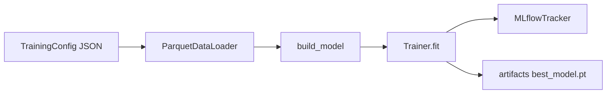

# ML Workstation

Modulo de treinamento, tracking e avaliacao de modelos de series temporais com PyTorch + MLflow.

## Documentos Principais

- Arquitetura: `src/ml_workstation/ARCHITECTURE.md`
- Avaliacao: `src/ml_workstation/evaluation/README.md`
- Guia geral: `docs/DEVELOPMENT_SETUP.md`
- Troubleshooting: `docs/TROUBLESHOOTING.md`

## Estrutura

```text
src/ml_workstation/
├── config/           # Schemas e validacao de configuracao
├── data/             # Dataset e loader de parquet
├── models/           # LSTM e Transformer
├── training/         # Loop de treino, metricas e checkpoint
├── tracking/         # Integracao com MLflow
├── evaluation/       # Avaliacao por run_id e grafico HTML
├── experiments/      # Configs JSON versionadas
├── artifacts/        # Checkpoints salvos
├── mlruns/           # Backend local do MLflow
├── Dockerfile
├── docker-compose.yml
└── train.py
```

## Fluxo de Execucao



## Convencoes de Experimento

- Arquivos em `experiments/lstm` e `experiments/transformer`.
- Padrao de nome: `<modelo>_<horizonte>_v<versao>.json`.
- Toda configuracao de experimento deve manter `"device": "cuda"`.

## Como Treinar

Todos os comandos abaixo devem ser executados em `src/ml_workstation`.

Build (CPU):

```bash
docker compose --profile train build trainer
```

Treino smoke test (CPU):

```bash
docker compose --profile train run --rm trainer --config //app/experiments/lstm/lstm_smoke_test.json
```

Treino exemplo (CPU):

```bash
docker compose --profile train run --rm trainer --config //app/experiments/lstm/lstm_h72_v1.json
docker compose --profile train run --rm trainer --config //app/experiments/transformer/transformer_h72_v1.json
```

Treino exemplo (GPU):

```bash
docker compose --profile train-gpu run --rm trainer-gpu --config //app/experiments/lstm/lstm_h72_v1.json
docker compose --profile train-gpu run --rm trainer-gpu --config //app/experiments/transformer/transformer_h72_v1.json
```

Loop em lote (GPU, 36 versoes):

```bash
for v in 1 2 3 4 5 6 7 8 9 10 11 12 13 14 15 16 17 18 19 20 21 22 23 24 25 26 27 28 29 30 31 32 33 34 35 36; do
  docker compose --profile train-gpu run --rm trainer-gpu --config "//app/experiments/lstm/lstm_h72_v${v}.json"
done
```

Observacao (Windows + Git Bash): use `//app/...` para evitar reescrita de path.

## MLflow

Subir UI:

```bash
docker compose --profile ui up -d mlflow-ui
```

Acesso: http://localhost:5000

## Governanca

Cada run registra:

- Parametros completos de configuracao.
- Tags e params de governanca (`governance.*`).
- Metricas por epoca e snapshot final.
- Checkpoint e modelo logado no MLflow.

Preenchimento automatico quando disponivel:

- `owner` via variavel `EMAIL`.
- `training_data_version` via hash em `data.dvc`.
- `git_sha` via commit atual.

## Avaliacao de Run

Executar na raiz do repositorio:

```bash
poetry run python -m src.ml_workstation.evaluation.run_evaluation --run-id <RUN_ID>
```

Saida: arquivo HTML em `evaluation_results/`.

## Qualidade

- Priorize smoke test antes de treinos longos.
- Revise metricas de validacao no MLflow antes de promover configuracoes.
- Mantenha sincronia entre `feature_columns` e schema real em `data/spec`.
